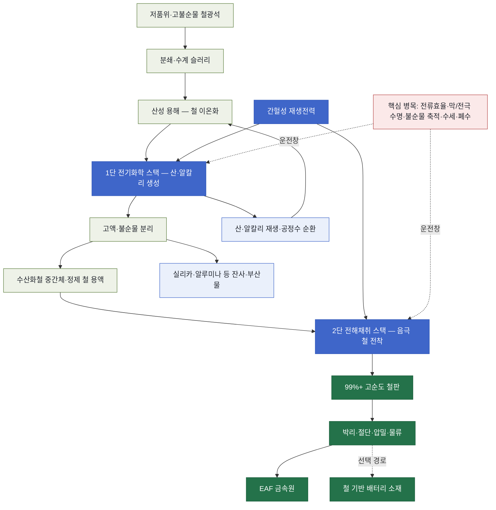
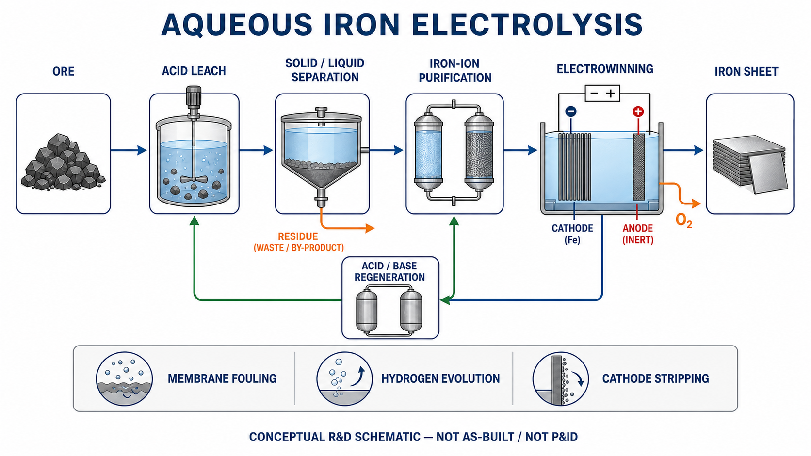

<!-- AUTO-GENERATED BY steel-intelligence. DO NOT EDIT. -->

# 저온 수계 전해제철 (Aqueous Iron Electrolysis)

> 조사 기준일: **2026-07-28** · 공식·1차 자료 중심 · 사실과 AI 분석을 구분해 작성

??? info "관련 기술 바로가기 · 현재 위치: 전해 기반 경로"

    탐색을 위한 편의 분류이며 기술 우열이나 확정된 공정 관계를 뜻하지 않습니다.

    **환원·용융 경로**

    [[technologies/TEC-hydrogen-direct-reduced-iron|수소 직접환원철 (Hydrogen DRI)]] · [[technologies/TEC-hydrogen-based-fine-ore-reduction|무펠릿 미분광 수소환원 (Fluidized-bed Hydrogen Reduction)]] · [[technologies/TEC-zesty-hydrogen-flash-reduction|ZESTY 수소 직접 플래시 환원]] · [[technologies/TEC-electric-smelting-furnace|전기용융로 (Electric Smelting Furnace)]] · [[technologies/TEC-hisarna-cyclone-smelting-reduction|HIsarna 사이클론 용융환원]] · [[technologies/TEC-hydrogen-plasma-smelting-reduction|수소 플라즈마 용융환원 (HPSR)]] · [[technologies/TEC-microwave-biomass-ironmaking|마이크로웨이브·바이오매스 환원제철 (BioIron)]]

    **전해 기반 경로**

    [[technologies/TEC-molten-oxide-electrolysis|용융산화물 전기분해 (Molten Oxide Electrolysis)]] · **저온 수계 전해제철 (Aqueous Iron Electrolysis) · 현재**

    **기존 설비·순환 경로**

    [[technologies/TEC-blast-furnace-ccus|고로 CCUS]] · [[technologies/TEC-high-grade-eaf-and-scrap-impurity-removal|고급강 EAF·스크랩 불순물 제거]]

    **통합·운영 기술**

    [[technologies/TEC-low-carbon-ironmaking|저탄소 제철 종합 경로 (Low-carbon Ironmaking)]] · [[technologies/TEC-smart-steelworks|스마트 제철소 (Smart Steelworks)]]

{ .steel-media-image .steel-hero-image .steel-media-detail }

*대표 이미지 — ElectraSteel 특허 Figure 4의 2단 철 전환 공정 및 도금 셀 구성도. 용해·산 재생·전해액 순환·막 분리 도금 셀·금속 철 제거를 보여주는 특허 실시예이며 Colorado 실증설비의 준공도는 아님 (특허 도면 · 권리 `link_only` · 출처 [[sources/SRC-20260728-BE2CCB14|SRC-20260728-BE2CCB14]] · [원문 페이지](https://patents.google.com/patent/US11753732B2/en))*

!!! abstract "한눈에 보기"

    | 항목 | 내용 |
    | --- | --- |
    | **분류 (편집)** | 저온 전기화학·습식제련 기반 철 생산 |
    | **핵심 원리** | 산성 수용액에 철광석을 용해하고 공존 광물을 분리하면서 산을 재생한 뒤, 전기를 가해 금속판 위에 철을 전착하는 저온 전기화학·습식제련 경로 [^src-20260725-d6930918] |
    | **운전 온도** | Electra 파일럿 발표 기준 140°F(약 60°C) [^src-20260725-3d62f9a6] |
    | **제품 순도** | Electra 주장 기준 99% 초과 순도의 철 [^src-20260725-3d62f9a6] |
    | **적용 원료** | 이미 채굴됐으나 고불순물 때문에 상업적으로 활용되지 못한 광석을 포함한 폭넓은 철광석 [^src-20260725-3d62f9a6] |
    | **후단 활용** | 생산 철은 전기로(EAF) 제강 원료 또는 철 기반 배터리 소재로 사용 가능 [^src-20260725-d6930918] |

## 개요

산성 수용액에 철광석을 용해하고 공존 광물을 분리하면서 산을 재생한 뒤, 전기를 가해 금속판 위에 철을 전착하는 저온 전기화학·습식제련 경로 [^src-20260725-d6930918]

이 문서에서 다루는 경로는 고온 용융염 전기분해가 아니라, 광석을 수용액에서 용해·분리한 뒤 철을 전착하는 저온 경로입니다.

- **근거 확인 기업:** 2개
- **직접 연결 근거:** 32건

## 작동 원리

- **전해 셀 구성:** 산·염기 생성 및 원료 분리를 담당하는 첫 번째 전기화학 셀 스택과, 수산화철을 금속 철로 바꾸는 전해채취 셀 스택의 2단 구성 [^src-20260725-133d1c12]

## 공정 구성

**색상 범례 (AI 재구성):** 녹회색=원료·용해·분리 · 청색=전기화학 스택·전력 · 연청색=약품·공정수 순환과 잔사 · 녹색=철 제품·후단 · 적색=확대 운전 병목

!!! note "도식 해석"

    위 흐름도는 Electra와 ARPA-E가 공개한 2단 전기화학 개념을 기능 단위로 재구성한 것입니다. 실제 전해액 조성, 막·전극 재료, 셀 직렬·병렬 배열, 물질수지와 폐수처리 설계는 공개되지 않았습니다. [^src-20260725-133d1c12][^src-20260725-d6930918]

## 주요 기술 특성

### 반응·셀·공정

| 구분 | 공개된 내용 | 근거 성격 |
| --- | --- | --- |
| **Fortescue DER 공정 경로** | Pilbara 철광석을 130°C 미만 알칼리 전해질의 고체 슬러리 전해조에서 환원하는 저온 DER 연구 경로 [^src-20260727-3d412017][^src-20260728-eeba9605] | 연구보고서·정부·공공자료 |
| **전해 셀 구성** | 산·염기 생성 및 원료 분리를 담당하는 첫 번째 전기화학 셀 스택과, 수산화철을 금속 철로 바꾸는 전해채취 셀 스택의 2단 구성 [^src-20260725-133d1c12] | 정부·공공자료 |

### 원료·운전·제품

| 구분 | 공개된 내용 | 근거 성격 |
| --- | --- | --- |
| **운전 온도** | Electra 파일럿 발표 기준 140°F(약 60°C) [^src-20260725-3d62f9a6] | 회사 발표 |
| **적용 원료** | 이미 채굴됐으나 고불순물 때문에 상업적으로 활용되지 못한 광석을 포함한 폭넓은 철광석 [^src-20260725-3d62f9a6] | 회사 발표 |
| **학술 검증 원료 범위** | 2023 학술 연구에서 혼합 hematite-magnetite 알칼리 현탁액의 저온 전해채취를 연구 규모로 검증 [^src-20260726-b9accb8f] | 학술지 논문 |
| **학술 검토 기술 범위** | RawMat 2021 학회 논문은 SIDERWIN의 저온 알칼리 철 전해채취 경로와 bauxite residue 적용 연구를 공개 [^src-20260726-7bceed6f] | 학회 논문 |
| **학술 실험 조건** | 2015 전도성 콜로이드 전극 실험: 45 wt% NaOH, 110 °C, 1.7 V, 5시간 전해 [^src-20260726-3f53ac8c] | 학술지 논문 |
| **제품 순도** | Electra 주장 기준 99% 초과 순도의 철 [^src-20260725-3d62f9a6] | 회사 발표 |
| **전력 운전 유연성** | 저온 공정 특성을 이용해 간헐성 재생전력의 가용 시간에 맞춰 생산을 동기화할 수 있다는 회사 주장 [^src-20260725-d6930918] | 회사 발표 |
| **후단 활용** | 생산 철은 전기로(EAF) 제강 원료 또는 철 기반 배터리 소재로 사용 가능 [^src-20260725-d6930918] | 회사 발표 |
| **실광석 조건별 전류효율** | 3.2 wt% Pilbara ore·100°C benchtop 조건에서 NaOH 30/40/60 wt%별 Faradaic efficiency 약 4%/28%/69%; 조건 한정 연구값 [^src-20260727-3d412017] | 연구보고서 |
| **분리막 조건 선별 결과** | 막 비교시험에서 약 6.2–9.9 kWh/kg-Fe와 Faradaic efficiency 약 32–53%가 보고됐으며, 단기 스크리닝 값으로 상업 원단위가 아님 [^src-20260727-3d412017] | 연구보고서 |
| **분리막 단기 운전시간** | 선정 막의 4시간 시험에서 crossover가 검출되지 않았으나, 막 수명이나 장기 안정성 입증으로 볼 수 없음 [^src-20260727-3d412017] | 연구보고서 |
| **Fortescue DER 확인 병목** | 수소발생 부반응, 실제 광석 불순물·물질전달, 미분 부착·fouling, 막 기계강도·전도도·비용, 전극 안정성이 핵심 scale-up 병목 [^src-20260727-3d412017] | 연구보고서 |

### 실증·산업화

| 구분 | 공개된 내용 | 근거 성격 |
| --- | --- | --- |
| **확대 검증 계획** | Volteron 개발사 발표는 1 m² 파일럿 성숙도와 규제 여건을 전제로 2026년 40–80 kt/y step-up plant 계약 로드맵을 제시했다. 이는 계획이며 가동 실적이 아니다. [^src-20260726-9f56db69] | 학회 발표 |
| **공개 성과의 한계** | 0.6 A/cm² 초과 값은 구조 제어된 모델 산화철 전극의 국소 결과이며, 광석 전처리·불순물 제거·전착물 회수를 포함한 연속 통합 플랜트 처리량·가동률·상업 경제성 성과가 아니다. [^src-20260728-ff583c8e] | 학술지 논문 |
| **Fortescue DER 단계 현황** | ARENA 공개기록상 Core Research Stage는 종료됐고 프로젝트 종료일은 2026-03-02다. 공개 final report는 Core Research 결과이며, 2026-07-28까지 별도 Research Commercialisation/Stage 2 최종보고서나 100 kg electrolyser·BOP commissioning·TRL 6 달성 근거는 확인되지 않았다. 이는 공개근거 공백이며 지연·중단 또는 실패 확정 근거는 아니다. [^src-20260728-eeba9605][^src-20260727-3d412017] | 정부·공공자료·연구보고서 |
| **Fortescue DER 확대 목표** | Stage 2 목표는 100 kg feed에서 magnetite 및/또는 metallic iron으로 50% 이상 전환하고 건설·시운전 후 TRL 6을 입증하는 것; 아직 달성 실적이 아님 [^src-20260727-3d412017][^src-20260728-eeba9605] | 연구보고서·정부·공공자료 |

### 최신 실증·검증 정보

기존 분류표에 속하지 않는 최신 공개 결과와 확대 계획을 별도로 보존합니다. 목표·계획 문구는 달성 실적으로 해석하지 않습니다.

| 구분 | 공개된 내용 | 근거 성격 |
| --- | --- | --- |
| **acidic deposit control boundary** | 온도·음극 샌드블라스트·전류 인가 방식 조절로 기포 탈리와 전착 형상을 개선할 수 있으나, 이는 연속 광석 침출·전해액 정제·산업적 박리·전극수명·제품 인증·플랜트 경제성 실증이 아니다. [^src-20260728-71d36a10] | 학술지 논문 |
| **acidic hydrogen evolution mechanism** | 2026년 산성 황산염 철 전해채취 실험은 수소 기포의 발생→성장→합체→탈리 과정이 전착층의 기공과 미세균열 형성·전파에 관여하며, 경쟁 수소발생이 전류효율과 균일도를 저해한다고 보고했다. [^src-20260728-71d36a10] | 학술지 논문 |
| **alkaline deposit growth boundary** | 400 cm2는 전극 기하 확대, 0.5 kg/m2/h는 전극면적당 성장률, 9시간은 전착 실험시간이다. 원광 전처리·전해액 재생·제품 박리·세척을 포함한 연속 플랜트 처리량·t/y 생산능력이나 전극 장기수명 근거가 아니다. [^src-20260728-e7d8d580] | 학술지 논문 |
| **alkaline deposit growth result** | 2026년 동료심사 연구는 28 wt% NaOH의 Fe2O3 현탁액에서 100 mA/cm2로 최대 9시간 전착해 0.5 kg/m2/h 초과 선택적 철 성장률을 유지했고, 400 cm2 다중 음극 stack에서도 다공성 철막의 효율 경향을 확인했다. [^src-20260728-e7d8d580] | 학술지 논문 |
| **alkaline suspension lab result** | 2026년 동료심사 실험은 25 mol/kg NaOH 또는 KOH 수계 전해질·110°C에서 Fe2O3/Fe3O4 분말 현탁액으로 철 전착을 확인했지만, 300 mA/cm² 초과에서는 수소발생 증가와 함께 전류효율이 저하되고 기포 피복에 따른 수지상 철 성장이 나타났다. [^src-20260728-3d63ef37] | 학술지 논문 |
| **apparent voltage boundary** | 해당 실험의 정상상태 셀 전압은 분극·옴 저항·부반응을 합친 겉보기 운전전압이며, 이를 이용한 에너지 기술자는 플랜트 에너지 원단위 실증이 아니다. 연속 고형물 처리·전착물 회수·불순물·전극수명·후단 용융도 범위 밖이다. [^src-20260728-3d63ef37] | 학술지 논문 |
| **citrate electrolyte boundary** | 95% 초과 효율은 10 mA/cm2의 정제 Fe2+ 염 전착 결과이고 10일은 전해액 화학 안정성 기간이다. 고전류 stack, 광석 용해·불순물 분리·citrate 회수·제품 harvesting 또는 10일 연속 생산 캠페인 성능이 아니다. [^src-20260728-7ccf544f] | 학술지 논문 |
| **citrate electrolyte result** | 2026년 ACS 동료심사 연구는 citrate co-anion으로 Fe2+ 배위를 조절한 FeCl2·FeSO4 전해질이 pH 5 이상에서 최대 10일 화학적으로 안정했고 10 mA/cm2에서 95% 초과 Faradaic efficiency와 철산화물 형성 억제를 보였다고 보고했다. [^src-20260728-7ccf544f] | 학술지 논문 |
| **electra ferric scrubber patent scope** | ElectraSteel의 2025 국제공개 특허는 Fe3+를 Fe2+로 전기화학 환원하면서 과도한 수소발생을 억제하는 ferric scrubber를 제안하지만, 실증설비 채택 여부와 연속운전 전류효율·수소 억제 KPI는 공개하지 않는다. [^src-20260728-ceb5a3b1] | 특허 |
| **electra patent cell architecture** | ElectraSteel 등록특허의 실시예는 산 재생 셀과 막으로 분리된 cathode/anode 도금 셀, catholyte·anolyte 순환 및 금속 철 제거를 연결하지만, 이는 Colorado demonstration facility의 준공도나 실제 연속운전 성능을 증명하지 않는다. [^src-20260728-be2ccb14] | 특허 |
| **fortescue continuous flow patent** | Fortescue의 EP4724635A1은 P80>20 µm 철광석을 알칼리 catholyte에 현탁해 separator로 분리된 flow cell에 순환하고, >1.4 V에서 환원한 iron-bearing particles를 분리한 뒤 광석을 보충해 catholyte를 재순환하는 연속화·multi-cell stack 아키텍처를 공개한다. 이는 특허상 scale-up 방향이며 Stage 2 설비 제작·연속운전 또는 TRL 6 달성 증거가 아니다. [^src-20260728-90668131] | 특허 |
| **high chloride fe3 electrodeposition result** | 2026년 CC BY 동료심사 연구는 상온 Fe3+ 수계 전착에서 7 M 초과 LiCl이 Fe3+ 안정화·물 활성 저하·점도 증가로 Fe2+ out-diffusion과 수소발생을 억제해 200 mA/cm2 초과 전류밀도에서 75% 초과 Coulombic efficiency를 보였다고 보고했다. [^src-20260728-c820f901] | 학술지 논문 |
| **high chloride scale boundary** | 75% 초과 효율은 고농도 LiCl·Fe3+ 전해질의 전하효율이다. 철광석 용해·불순물 분리·염 회수·금속 박리·세척을 포함한 플랜트 효율이나 장기 전극 수명·연속 처리량이 아니며 Electra 실증설비 채택 근거도 없다. [^src-20260728-c820f901] | 학술지 논문 |
| **independent scale up assessment** | Ramboll 2026 비교평가 기준 수계 철 전해는 저품위 원료와 소규모 모듈 공장의 잠재력이 있으나 대규모 에너지·비용 효율은 아직 입증되지 않음 [^src-20260728-60d60f81] | 전문매체 |
| **industrialization evidence limit** | 저온 수계 철 전해는 약 100°C 운전 잠재력이 있으나 전류효율, 치밀한 제품 형성, 실제 광석 불순물, 전극·반응기 설계와 변동성 재생전력 연계가 미해결 과제이며, 개별 파일럿 결과를 상업 성능으로 일반화할 수 없다. [^src-20260728-e8cb361f] | 학술지 논문 |
| **laboratory current density** | 2025 ACS Energy Letters 연구는 미크론 크기·나노기공 α-Fe2O3의 직접 알칼리 전해에서 외부 강제대류 없이 0.6 A/cm² 초과 철 생성 전류밀도를 보고했다. [^src-20260728-ff583c8e] | 학술지 논문 |
| **magnetite particle size result** | 2026년 50 wt.% NaOH·110°C·10 wt.% 산화철 현탁액의 교반 셀 실험에서 d50 약 1.5 μm 고순도 합성 magnetite는 Faradaic efficiency 76%, 유사 크기 hematite는 88%였고, 더 큰 합성·천연 magnetite는 약 54%였다. 연구진은 magnetite의 수소발생 촉진과 큰 입자의 분극 증가를 효율 저하와 연결했다. [^src-20260728-9c00a766] | 학술지 논문 |
| **magnetite result boundary** | 76%·88%·약 54%는 1.66 V 시작 후 1,070 A/m²로 전환한 기계교반 평판전극 실험의 Faradaic efficiency다. 연속 광석 전처리·전착물 회수·전해액 재생·불순물 관리·stack 면적·전극수명·전력원단위·상업 처리량이나 Volteron/Electra 운전 KPI가 아니다. [^src-20260728-9c00a766] | 학술지 논문 |
| **route specific bottlenecks** | 2026년 학술 종설은 저온 수계 전해를 알칼리계와 산성계로 구분한다. 알칼리계는 비교적 높은 전류효율·낮은 부식성 대신 산화철 저용해도와 느린 고체상 물질전달이, 산성계는 빠른 용존이온 환원 대신 수소발생과 부식이 핵심 병목이다. [^src-20260728-e8cb361f] | 학술지 논문 |
| **volteron scale validation** | 2025년 Volteron 1:1 수직 셀 성공 운전과 full-scale 플랜트 엔지니어링 설계 완료가 회사 보고로 확인됐지만, 산업 플랜트의 투자결정·건설·연속 상업운전 실적은 아직 별도 단계다. [^src-20260728-53edaf62][^src-20260728-600abf35] | 회사 IR·정부·공공자료 |

## 공개 개발 연혁

| 날짜 | 공개 사건 |
| --- | --- |
| 2015-01-07 | Low temperature electrolysis for iron production via conductive colloidal electrode [^src-20260726-3f53ac8c] |
| 2021-09-05 | ΣIDERWIN—A New Route for Iron Production [^src-20260726-7bceed6f] |
| 2023-05-01 | Low-Temperature Electrowinning of Iron from Mixed Hematite-Magnetite Alkaline Suspensions [^src-20260726-b9accb8f] |
| 2023-06-14 | ArcelorMittal and John Cockerill develop Volteron low-temperature electrolysis [^src-20260725-a6716adb] |
| 2023-09-12 | Ore dissolution and iron conversion system (US11753732B2) [^src-20260728-be2ccb14] |
| 2024-03-27 | Electra Launches Pilot Plant to Advance Commercialization of Sustainable Clean Iron Production [^src-20260725-3d62f9a6] |
| 2025-04-09 | Pathways to Electrochemical Ironmaking at Scale Via the Direct Reduction of Fe2O3 [^src-20260728-ff583c8e] |
| 2025-09-25 | High efficiency iron electrowinning (WO2025199035A1) [^src-20260728-ceb5a3b1] |
| 2025-10-21 | Electra Unveils Demonstration Facility along with Advanced Purchase Commitments for Clean Iron and Environmental Attributes [^src-20260727-44dc8b30] |
| 2025-12-22 | Low Temperature Direct Electrochemical Reduction for Zero Emissions Iron Project - Core Research Final Report [^src-20260727-3d412017] |
| 2026-02-11 | Stable, Efficient Iron Electrodeposition via Anion-Directed Control of Fe(II) Coordination [^src-20260728-7ccf544f] |
| 2026-02-12 | Production of Iron from Iron Oxide Powder by Suspension Electrolysis in Alkaline Electrolyte [^src-20260728-3d63ef37] |
| 2026-03-06 | ArcelorMittal 2025 Form 20-F: Volteron pilot and industrial engineering [^src-20260728-53edaf62] |
| 2026-03-09 | Volteron — Scalable Electrochemical Ironmaking for Green Steel Production [^src-20260726-9f56db69] |
| 2026-03-10 | Electra Secures $30M in New Capital to Accelerate Commercial Production [^src-20260728-1be1edaf] |
| 2026-03-12 | EAFs increasingly able to fill blast furnace gap: Electra [^src-20260728-4b823cfa] |
| 2026-03-15 | Hydrogen evolution behavior and morphology regulation of electrowinning of iron in acidic sulfate system [^src-20260728-71d36a10] |
| 2026-04-01 | Fortescue low-temperature DER project and Core Research public status [^src-20260728-eeba9605] |
| 2026-04-14 | Microstructure and Faradaic Efficiency of Electrodeposited Iron in NaOH(aq) [^src-20260728-e7d8d580] |
| 2026-04-15 | EP4724635A1 — Process and system for electrolytically producing an iron-bearing product from iron ore particles [^src-20260728-90668131] |
| 2026-04-23 | Electra demonstration-facility electrowinning baths installed [^src-20260728-f9066cb4] |
| 2026-04-28 | POSCO and Electra partner on low-temperature clean iron [^src-20260725-4c014458] |
| 2026-04-28 | Editors Choice—Understanding the Role of Multivalency in Chloride-Based Electrolytes for Efficient Iron Electrosynthesis [^src-20260728-c820f901] |
| 2026-06-24 | CO2-free alkaline electrolysis of magnetite suspensions: impact of mineralogical source and particle size [^src-20260728-9c00a766] |

## 설비·공정 이미지

{ .steel-media-image .steel-media-detail }

**AI 재구성.** AI 재구성 — 광석 침출·고액분리·철 이온 정제·전해채취·철판 회수와 산/염기 재생의 기능 흐름. 특정 기업의 준공도·P&ID가 아니다.

- 출처 [[sources/SRC-20260725-133D1C12|SRC-20260725-133D1C12]] · 권리 `ai_generated` · [원문 페이지](https://arpa-e.energy.gov/sites/default/files/2025-04/ARPA-E%20Project%20Descriptions_ROSIE_R25.1.pdf) · 작성·촬영 OpenAI ImageGen
- 권리 메모: 공개 기술 근거를 바탕으로 2026-07-27 생성한 개념도. 실제 설비 배치·물질수지·P&ID가 아니다.

{ .steel-media-image .steel-media-compact }

**실제 설비 사진.** Electra Boulder 파일럿의 저온 철 전해채취 셀에서 생산한 철판을 점검하는 연구진

- 출처 [[sources/SRC-20260725-3D62F9A6|SRC-20260725-3D62F9A6]] · 권리 `link_only` · [원문 페이지](https://www.businesswire.com/news/home/20240327121089/en/Electra-Launches-Pilot-Plant-to-Advance-Commercialization-of-Sustainable-Clean-Iron-Production) · 작성·촬영 Electra / Business Wire
- 권리 메모: 공식 보도자료 이미지이나 재사용 권리가 명확하지 않아 원문 링크만 보존

{ .steel-media-image .steel-media-compact }

**실제 설비 사진.** Electra 파일럿 설비에서 대형 전착 철판을 점검하는 연구진

- 출처 [[sources/SRC-20260725-D6930918|SRC-20260725-D6930918]] · 권리 `permitted` · [원문 페이지](https://www.electra.earth/) · 작성·촬영 Electra
- 권리 메모: Electra 공식 홈페이지 공개 이미지이며 내부 기술 인텔리전스 문서에 출처·원문 링크와 함께 사용; 외부 재배포 전 별도 권리 확인 필요

{ .steel-media-image .steel-media-compact }

**AI 재구성.** Volteron 저온 수계 전해의 광석 용해·불순물 분리·전해액 순환·철판 전착 경로 AI 재구성. 실제 R&D 설비의 준공도가 아님

- 출처 [[sources/SRC-20260725-FBE26310|SRC-20260725-FBE26310]] · 권리 `ai_generated` · [원문 페이지](https://corporate.arcelormittal.com/media/insights-and-podcasts/insights/steel-thoughts-developing-breakthrough-process-innovations) · 작성·촬영 OpenAI image generation / Codex
- 권리 메모: ArcelorMittal 공식 R&D 설명을 바탕으로 생성했으며 실제 장치 형상과 배치의 증거로 사용하지 않음

{ .steel-media-image .steel-media-compact }

**실제 설비 사진.** Electra가 2026년 4월 공개한 Colorado demonstration facility의 electrowinning bath 설치 현장. 핵심 전해조 설비의 현장 반입·설치를 보여주지만, 시운전 완료·연속 생산·500 t/y 달성을 입증하는 사진은 아니다.

- 출처 [[sources/SRC-20260728-F9066CB4|SRC-20260728-F9066CB4]] · 권리 `link_only` · [원문 페이지](https://www.linkedin.com/posts/electra-earth_a-lot-of-hard-work-became-real-this-week-activity-7453155218462183424-N15E) · 작성·촬영 Electra; photographer not identified
- 권리 메모: Company LinkedIn post; no reuse licence or photographer credit identified. Remote display only. The image documents installation status, not commissioning or production performance.

{ .steel-media-image .steel-media-compact }

**실제 설비 사진.** John Cockerill 공식 SIDERWIN/Volteron 계열 저온 수계 철 전해 파일럿 설비 사진; 산업규모 플랜트 준공 사진이 아님

- 출처 [[sources/SRC-20260728-BDB79FE9|SRC-20260728-BDB79FE9]] · 권리 `link_only` · [원문 페이지](https://johncockerill.com/en/industry/metals/iron-steel-making) · 작성·촬영 John Cockerill
- 권리 메모: John Cockerill 공식 제품 페이지에서 캡션과 원본을 확인했으나 복제 라이선스가 없어 원격 링크로만 표시

{ .steel-media-image .steel-media-detail }

**공정 개념도.** John Cockerill 공식 Volteron 개략 공정도: 철광석 분쇄·청정전력·산화철 전해·용해로 연계; 상세 물질수지나 준공도는 아님

- 출처 [[sources/SRC-20260728-BDB79FE9|SRC-20260728-BDB79FE9]] · 권리 `link_only` · [원문 페이지](https://johncockerill.com/en/industry/metals/iron-steel-making) · 작성·촬영 John Cockerill
- 권리 메모: John Cockerill 공식 제품 페이지에서 원본과 맥락을 확인했으나 복제 라이선스가 없어 원격 링크로만 표시

## 기업별 상세 현황

### [[companies/COM-POSCO|POSCO]]

**확인된 현황.** Electra와 저온 전기화학 철 생산 공동개발·투자; 연산 500톤 시범공장의 상업화 기술·경제성 공동 검증 단계 [^src-20260725-4c014458]

**단계 판단: 계획·투자.** 기업의 방향성과 자원 투입 의지는 확인되지만 실제 설비 성능이나 상용 운전이 입증된 단계는 아닙니다.

- **날짜:** 발표 2026-04-28 · 수집 2026-07-25 · 검증 2026-07-25

### [[companies/COM-ArcelorMittal|ArcelorMittal]]

**확인된 현황.** Volteron 저온 직접 전해를 공식 설명 기준 TRL 6 R&D 설비까지 확대했으나 4만~8만 t/y 산업 1단계의 착공·가동은 미확인 [^src-20260725-fbe26310]

**단계 판단: 건설·구축.** 설비 투자가 물리적 실행 단계에 들어갔습니다. 준공 일정, 공사비 변동과 시운전 결과가 다음 판단 기준입니다.

- **날짜:** 발표 미상 · 수집 2026-07-25 · 검증 2026-07-25

## 관련 프로젝트

기술의 실제 확대 단계를 확인할 수 있도록 프로젝트 문서와 현재 상태를 직접 연결합니다. 각 프로젝트 문서에는 최근 상태뿐 아니라 확인 가능한 전체 일정 이력이 표시됩니다.

| 프로젝트 | 현재 확인 상태 | 일정·규모 |
| --- | --- | --- |
| **[[projects/PRJ-ELECTRA-CLEAN-IRON-DEMO|Electra 청정철 시범공장]]** | 2026년 가동 목표로 시범공장 건설 중 [^src-20260725-4c014458] | **연간 생산능력** 연간 500톤 (500 tpy) [^src-20260725-4c014458][^src-20260727-44dc8b30][^src-20260728-4b823cfa] · **목표 가동 시점** 2026년 [^src-20260725-4c014458] |
| **[[projects/PRJ-ARCELORMITTAL-VOLTERON|ArcelorMittal–John Cockerill Volteron]]** | 2025년 1:1 수직 셀 파일럿의 성공 운전과 산업규모 플랜트 엔지니어링 설계 완료가 확인됐으나, 40,000~80,000 t/y 단계의 FID·착공·가동은 확인되지 않음 [^src-20260728-53edaf62] | **연간 생산능력** 2023년 발표한 산업 1단계 목표 40,000~80,000 t/y [^src-20260725-a6716adb] · **목표 가동 시점** 2023년 발표 당시 2027년 생산 개시 목표; 현재 착공·가동 확인 필요 [^src-20260725-a6716adb] |

## 기술적 쟁점과 미공개 데이터

!!! warning "AI 분석 — 공개 근거와 구분"

    기업별 단계는 인용된 공식 발표 문구를 기준으로 분류한 것으로, 정식 TRL 판정이나 기술 경쟁력 순위가 아닙니다.

- **추가 확인이 필요한 데이터:** 전력원단위·전류효율, 산·알칼리·공정수 회수율, 광종별 철 회수와 불순물 거동, 막·전극 수명, 스택 가동률, 전착 철판 자동 회수, 500 tpy 실제 월간 생산량과 EAF 장입 시험, 다음 규모 투자 결정을 확인해야 합니다.
- 기업 간 비교에는 시험 규모, 실제 투입 원료·에너지 조건, 상용 운전 실적과 제품 단위 배출량을 같은 기준으로 적용해야 합니다.
- 저온이라는 표현은 공정 전체의 에너지 부담이 작다는 뜻이 아닙니다. 광석 분쇄·용해, 산·알칼리 재생, 불순물 분리, 전해채취, 철판 박리·건조·압밀과 공정수 처리를 모두 포함한 kWh/t-Fe와 시약 보충량이 필요합니다.
- 두 개의 전기화학 스택은 역할이 다릅니다. 첫 스택은 산·염기와 원료 정제를 담당하고 두 번째 스택은 금속 철을 전착하므로, 어느 한쪽의 전류효율·막 저항·가동률이 낮아도 전체 생산능력과 원가가 제한됩니다.
- 고불순물 광석 수용 능력은 불순물이 사라진다는 뜻이 아니라 용액·고체 잔사로 이동한다는 뜻입니다. Al·Si·P·Ti·Mg와 미량금속이 용해·침전·막 오염·제품 순도에 미치는 영향과 부산물 판로를 광종별로 확인해야 합니다.
- 철 전착은 수소발생과 경쟁할 수 있으므로 pH, 철 이온 농도, 전류밀도, 온도와 유동이 전류효율·표면 형상·박리성에 함께 영향을 줍니다. 99%+ 순도만으로 산업 생산성이나 낮은 전력원단위를 입증할 수 없습니다.
- 간헐 재생전력 추종은 저온 공정의 잠재 장점이지만 정지·재가동 때 용액 조성, 침전, 막 수화, 전극 표면과 열수지가 안정적으로 복원돼야 합니다. 단순 부하 감축 가능성과 빈번한 사이클 운전 수명을 구분해야 합니다.
- 전착 철판은 고로 용선이나 DRI와 물성·물류가 다릅니다. 두께·취성·표면 수분, 산소·수소·잔류염, 절단·압밀 밀도와 EAF 장입 거동이 후단 수율과 에너지에 미치는 영향을 확인해야 합니다.
- 연산 500 t 시범공장은 상용 제철소보다 여러 자릿수 작습니다. 핵심 확대 지표는 명목 용량보다 셀 면적당 전류, 연속 캠페인 시간, 스택 가용률, 막·전극 교체주기, 제품 회수 자동화와 실제 월간 생산량입니다.

## POSCO 관점 시사점

!!! info "AI 분석 — 전략 검토용"

    다음 내용은 공개 근거를 바탕으로 한 비교 분석이며, POSCO의 공식 결정이나 투자 권고가 아닙니다.

- POSCO와 Electra의 공동검증은 HyREX·전기로와 경쟁시키기보다 원료·전력 조건이 다른 선택지로 비교해야 합니다. 동일 광석 기준 선광·펠릿화 회피 편익과 습식 분쇄·약품·전해·폐수 부담을 하나의 시스템 경계에서 계산할 필요가 있습니다.
- 광양 전기로 투입 시험 전에는 전착 철의 벌크밀도, 수분·염소·황·인·수소, 용해속도, 슬래그량, Fe 수율과 장입 자동화를 검증해야 합니다. 고순도 수치와 자동차강판용 실제 금속원 적합성은 같은 판단이 아닙니다.
- 국내에서의 경제성은 전력가격뿐 아니라 산·알칼리 순환, 용수·폐수, 불순물 잔사 처리와 광석 물류에 민감합니다. 저가 재생전력 시간대 추종이 설비 이용률 저하를 상쇄하는지 시간대별 운전모델로 확인해야 합니다.
- 우선 모니터링 지표는 kWh/t-Fe, 전류효율, 셀 전압·전류밀도, 스택 가용률, 막·전극 수명, 산·알칼리·물 보충량, 광종별 철 회수율, 제품 순도·수분·잔류염, 잔사량, 월간 생산량과 EAF 용해 성과입니다.

## 12–36개월 기술 센싱 대시보드

!!! info "AI 분석 — 연구·전략 의사결정용"

    아래 항목은 공개된 목표가 실제 성과로 전환되는지를 추적하기 위한 관찰 프레임입니다. 정식 TRL 판정이나 투자 권고가 아닙니다.

### 성숙도 승격 신호

- 500 t/y급 시설에서 월간 생산량, stack uptime, 전류효율, kWh/t-Fe, 제품 순도와 고객 EAF qualification을 함께 공개
- 막·전극 수명, 산·알칼리·공정수 회수, 실광석 철 회수율·불순물 분배를 4시간 시험이 아닌 장기 캠페인으로 검증
- Electra·Volteron·Fortescue가 pilot 목표를 commissioning·반복 생산·후속 상용 모듈 FID로 전환

### 지연·실패 신호

- 명목 용량·구매의향·TRL 목표만 갱신되고 실제 월별 생산·전력·소모품 데이터와 납품 품질 결과가 없음
- 고순도 시약 또는 정제원료 결과를 저품위 실광석 성능으로 일반화하거나 전류효율 최고값을 시스템 에너지로 환산

### POSCO 판단 질문

- 수계 전해를 벌크 철 대체와 고순도 철 premium 시장 중 어디에 먼저 적용할 것인가?
- 광석 전처리·침출·막·전착 회수·폐액 중 POSCO가 직접 확보할 병목 IP는 무엇인가?
- MOE·수소 DRI 대비 전력·물·시약·원료 품위의 crossover를 어떤 자체 bench/pilot 시험으로 확인할 것인가?

## 출처

- [[sources/SRC-20260725-133D1C12|ROSIE Project Descriptions: Electra Low-Temperature Green Ironmaking]] — U.S. Department of Energy ARPA-E, 게시일 미상 · [원문](https://arpa-e.energy.gov/sites/default/files/2025-04/ARPA-E%20Project%20Descriptions_ROSIE_R25.1.pdf)
- [[sources/SRC-20260725-3D62F9A6|Electra Launches Pilot Plant to Advance Commercialization of Sustainable Clean Iron Production]] — Electra / Business Wire, 2024-03-27 · [원문](https://www.businesswire.com/news/home/20240327121089/en/Electra-Launches-Pilot-Plant-to-Advance-Commercialization-of-Sustainable-Clean-Iron-Production)
- [[sources/SRC-20260725-4C014458|POSCO and Electra partner on low-temperature clean iron]] — POSCO Group Newsroom, 2026-04-28 · [원문](https://newsroom.posco.com/kr/%ED%8F%AC%EC%8A%A4%EC%BD%94-%EC%A0%80%ED%83%84%EC%86%8C-%EC%A0%9C%EC%B2%A0-%EA%B8%B0%EC%88%A0-%EB%B3%B4%EC%9C%A0-%E7%BE%8E-%ED%98%81%EC%8B%A0%EA%B8%B0%EC%97%85-%EC%9D%BC%EB%A0%89%ED%8A%B8%EB%9D%BC/)
- [[sources/SRC-20260725-A6716ADB|ArcelorMittal and John Cockerill develop Volteron low-temperature electrolysis]] — ArcelorMittal, 2023-06-14 · [원문](https://corporate.arcelormittal.com/media/news/regulatory-news/arcelormittal-and-john-cockerill-announce-plans-to-develop-world-s-first-industrial-scale-low-temperature-iron-electrolysis-plant)
- [[sources/SRC-20260725-D6930918|Electra Technology: How the low-temperature iron process works]] — Electra, 게시일 미상 · [원문](https://www.electra.earth/our-technology/)
- [[sources/SRC-20260725-FBE26310|ArcelorMittal Volteron research and scale-up status]] — ArcelorMittal, 게시일 미상 · [원문](https://corporate.arcelormittal.com/media/insights-and-podcasts/insights/steel-thoughts-developing-breakthrough-process-innovations)
- [[sources/SRC-20260726-3F53AC8C|Low temperature electrolysis for iron production via conductive colloidal electrode]] — RSC Advances / Royal Society of Chemistry, 2015-01-07 · [원문](https://pubs.rsc.org/en/content/articlehtml/2015/ra/c4ra14576c)
- [[sources/SRC-20260726-7BCEED6F|ΣIDERWIN—A New Route for Iron Production]] — Materials Proceedings / MDPI, 2021-09-05 · [원문](https://doi.org/10.3390/materproc2021005058)
- [[sources/SRC-20260726-9F56DB69|Volteron — Scalable Electrochemical Ironmaking for Green Steel Production]] — Association for Iron & Steel Technology, 2026-03-09 · [원문](https://www.aist.org/getmedia/b2126be4-4ee8-47eb-a536-56cacf43d492/Scalable-Electrochemical-Ironmaking-or-Green-Steel-Production.pdf)
- [[sources/SRC-20260726-B9ACCB8F|Low-Temperature Electrowinning of Iron from Mixed Hematite-Magnetite Alkaline Suspensions]] — Journal of The Electrochemical Society, 2023-05-01 · [원문](https://doi.org/10.1149/1945-7111/acd085)
- [[sources/SRC-20260727-3D412017|Low Temperature Direct Electrochemical Reduction for Zero Emissions Iron Project - Core Research Final Report]] — Fortescue, Deakin University, Curtin University / ARENA, 2025-12-22 · [원문](https://arena.gov.au/assets/2026/01/Fortescue-Low-Temp-Direct-Electrochemical-Reduction-for-Zero-Emissions-Iron-Core-Research-Final-Report.pdf)
- [[sources/SRC-20260727-44DC8B30|Electra Unveils Demonstration Facility along with Advanced Purchase Commitments for Clean Iron and Environmental Attributes]] — Electra / GlobeNewswire, 2025-10-21 · [원문](https://www.globenewswire.com/news-release/2025/10/21/3170489/0/en/Electra-Unveils-Demonstration-Facility-along-with-Advanced-Purchase-Commitments-for-Clean-Iron-and-Environmental-Attributes.html)
- [[sources/SRC-20260727-71A7FA21|Low temperature electrolysis of iron ore in an aqueous alkaline solution - Volteron]] — European Commission Joint Research Centre / INCITE, 게시일 미상 · [원문](https://innovation-centre-for-industrial-transformation.ec.europa.eu/innovative-techniques/low-temperature-electrolysis-iron-ore-aqueous-alkaline-solution-volterontm)
- [[sources/SRC-20260728-0356E66A|Electra hosts Toyota Tsusho at demonstration facility to show Clean Iron technology in action]] — Electra, 게시일 미상 · [원문](https://www.linkedin.com/company/electra-earth)
- [[sources/SRC-20260728-1BE1EDAF|Electra Secures $30M in New Capital to Accelerate Commercial Production]] — Electra / GlobeNewswire, 2026-03-10 · [원문](https://www.globenewswire.com/news-release/2026/03/10/3252582/0/en/Electra-Secures-30M-in-New-Capital-to-Accelerate-Commercial-Production.html)
- [[sources/SRC-20260728-3D63EF37|Production of Iron from Iron Oxide Powder by Suspension Electrolysis in Alkaline Electrolyte]] — American Chemical Society, 2026-02-12 · [원문](https://doi.org/10.1021/acs.jpcc.5c08453)
- [[sources/SRC-20260728-4B823CFA|EAFs increasingly able to fill blast furnace gap: Electra]] — Fastmarkets, 2026-03-12 · [원문](https://www.fastmarkets.com/insights/eaf-able-to-fill-blast-iron-furnace-gap/)
- [[sources/SRC-20260728-53EDAF62|ArcelorMittal 2025 Form 20-F: Volteron pilot and industrial engineering]] — ArcelorMittal, 2026-03-06 · [원문](https://cms.arcelormittal.com/media/21bhvfoo/mt-31-12-2025-20-f-document.pdf)
- [[sources/SRC-20260728-600ABF35|Low temperature electrolysis of iron ore in an aqueous alkaline solution - Volteron]] — European Commission INCITE, 게시일 미상 · [원문](https://innovation-centre-for-industrial-transformation.ec.europa.eu/innovative-techniques/low-temperature-electrolysis-iron-ore-aqueous-alkaline-solution-volterontm)
- [[sources/SRC-20260728-60D60F81|Forging a cleaner future: Advances and business models in electrochemical iron production]] — Ramboll, 게시일 미상 · [원문](https://c.ramboll.com/hubfs/Low-Carbon-Steel/Electrochemical-Whitepaper.pdf)
- [[sources/SRC-20260728-71D36A10|Hydrogen evolution behavior and morphology regulation of electrowinning of iron in acidic sulfate system]] — Elsevier, 2026-03-15 · [원문](https://doi.org/10.1016/j.jclepro.2026.147910)
- [[sources/SRC-20260728-7CCF544F|Stable, Efficient Iron Electrodeposition via Anion-Directed Control of Fe(II) Coordination]] — American Chemical Society, 2026-02-11 · [원문](https://doi.org/10.1021/acselectrochem.5c00521)
- [[sources/SRC-20260728-90668131|EP4724635A1 — Process and system for electrolytically producing an iron-bearing product from iron ore particles]] — Fortescue Future Industries Pty Ltd / European Patent Office, 2026-04-15 · [원문](https://patents.google.com/patent/EP4724635A1/en)
- [[sources/SRC-20260728-9C00A766|CO2-free alkaline electrolysis of magnetite suspensions: impact of mineralogical source and particle size]] — Chemical Engineering Journal Advances / Elsevier, 2026-06-24 · [원문](https://www.sciencedirect.com/science/article/pii/S2666821126002619)
- [[sources/SRC-20260728-BE2CCB14|Ore dissolution and iron conversion system (US11753732B2)]] — United States Patent and Trademark Office (USPTO), 2023-09-12 · [원문](https://patents.google.com/patent/US11753732B2/en)
- [[sources/SRC-20260728-C820F901|Editors Choice—Understanding the Role of Multivalency in Chloride-Based Electrolytes for Efficient Iron Electrosynthesis]] — The Electrochemical Society / IOP Publishing, 2026-04-28 · [원문](https://doi.org/10.1149/1945-7111/ae60a9)
- [[sources/SRC-20260728-CEB5A3B1|High efficiency iron electrowinning (WO2025199035A1)]] — World Intellectual Property Organization (WIPO), 2025-09-25 · [원문](https://patents.google.com/patent/WO2025199035A1/en)
- [[sources/SRC-20260728-E7D8D580|Microstructure and Faradaic Efficiency of Electrodeposited Iron in NaOH(aq)]] — The Electrochemical Society / IOP Publishing, 2026-04-14 · [원문](https://doi.org/10.1149/1945-7111/ae4427)
- [[sources/SRC-20260728-E8CB361F|Decarbonizing ironmaking through green-electricity-driven low-temperature electrodeposition]] — Elsevier / Hydrometallurgy, 게시일 미상 · [원문](https://doi.org/10.1016/j.hydromet.2026.106804)
- [[sources/SRC-20260728-EEBA9605|Fortescue low-temperature DER project and Core Research public status]] — Australian Renewable Energy Agency, 2026-04-01 · [원문](https://arena.gov.au/projects/fortescue-low-temperature-direct-electrochemical-reduction-for-zero-emissions-iron-project/)
- [[sources/SRC-20260728-F9066CB4|Electra demonstration-facility electrowinning baths installed]] — Electra, 2026-04-23 · [원문](https://www.linkedin.com/posts/electra-earth_a-lot-of-hard-work-became-real-this-week-activity-7453155218462183424-N15E)
- [[sources/SRC-20260728-FF583C8E|Pathways to Electrochemical Ironmaking at Scale Via the Direct Reduction of Fe2O3]] — American Chemical Society / U.S. DOE OSTI, 2025-04-09 · [원문](https://www.osti.gov/pages/biblio/2555805)

[^src-20260725-133d1c12]: **ROSIE Project Descriptions: Electra Low-Temperature Green Ironmaking** — U.S. Department of Energy ARPA-E, 게시일 미상. [원문](https://arpa-e.energy.gov/sites/default/files/2025-04/ARPA-E%20Project%20Descriptions_ROSIE_R25.1.pdf) · [[sources/SRC-20260725-133D1C12|보관 원문·메타데이터]]
[^src-20260725-3d62f9a6]: **Electra Launches Pilot Plant to Advance Commercialization of Sustainable Clean Iron Production** — Electra / Business Wire, 2024-03-27. [원문](https://www.businesswire.com/news/home/20240327121089/en/Electra-Launches-Pilot-Plant-to-Advance-Commercialization-of-Sustainable-Clean-Iron-Production) · [[sources/SRC-20260725-3D62F9A6|보관 원문·메타데이터]]
[^src-20260725-4c014458]: **POSCO and Electra partner on low-temperature clean iron** — POSCO Group Newsroom, 2026-04-28. [원문](https://newsroom.posco.com/kr/%ED%8F%AC%EC%8A%A4%EC%BD%94-%EC%A0%80%ED%83%84%EC%86%8C-%EC%A0%9C%EC%B2%A0-%EA%B8%B0%EC%88%A0-%EB%B3%B4%EC%9C%A0-%E7%BE%8E-%ED%98%81%EC%8B%A0%EA%B8%B0%EC%97%85-%EC%9D%BC%EB%A0%89%ED%8A%B8%EB%9D%BC/) · [[sources/SRC-20260725-4C014458|보관 원문·메타데이터]]
[^src-20260725-a6716adb]: **ArcelorMittal and John Cockerill develop Volteron low-temperature electrolysis** — ArcelorMittal, 2023-06-14. [원문](https://corporate.arcelormittal.com/media/news/regulatory-news/arcelormittal-and-john-cockerill-announce-plans-to-develop-world-s-first-industrial-scale-low-temperature-iron-electrolysis-plant) · [[sources/SRC-20260725-A6716ADB|보관 원문·메타데이터]]
[^src-20260725-d6930918]: **Electra Technology: How the low-temperature iron process works** — Electra, 게시일 미상. [원문](https://www.electra.earth/our-technology/) · [[sources/SRC-20260725-D6930918|보관 원문·메타데이터]]
[^src-20260725-fbe26310]: **ArcelorMittal Volteron research and scale-up status** — ArcelorMittal, 게시일 미상. [원문](https://corporate.arcelormittal.com/media/insights-and-podcasts/insights/steel-thoughts-developing-breakthrough-process-innovations) · [[sources/SRC-20260725-FBE26310|보관 원문·메타데이터]]
[^src-20260726-3f53ac8c]: **Low temperature electrolysis for iron production via conductive colloidal electrode** — RSC Advances / Royal Society of Chemistry, 2015-01-07. DOI: [10.1039/C4RA14576C](https://doi.org/10.1039/C4RA14576C). [원문](https://pubs.rsc.org/en/content/articlehtml/2015/ra/c4ra14576c) · [[sources/SRC-20260726-3F53AC8C|보관 원문·메타데이터]]
[^src-20260726-7bceed6f]: **ΣIDERWIN—A New Route for Iron Production** — Materials Proceedings / MDPI, 2021-09-05. DOI: [10.3390/materproc2021005058](https://doi.org/10.3390/materproc2021005058). [원문](https://doi.org/10.3390/materproc2021005058) · [[sources/SRC-20260726-7BCEED6F|보관 원문·메타데이터]]
[^src-20260726-9f56db69]: **Volteron — Scalable Electrochemical Ironmaking for Green Steel Production** — Association for Iron & Steel Technology, 2026-03-09. [원문](https://www.aist.org/getmedia/b2126be4-4ee8-47eb-a536-56cacf43d492/Scalable-Electrochemical-Ironmaking-or-Green-Steel-Production.pdf) · [[sources/SRC-20260726-9F56DB69|보관 원문·메타데이터]]
[^src-20260726-b9accb8f]: **Low-Temperature Electrowinning of Iron from Mixed Hematite-Magnetite Alkaline Suspensions** — Journal of The Electrochemical Society, 2023-05-01. DOI: [10.1149/1945-7111/acd085](https://doi.org/10.1149/1945-7111/acd085). [원문](https://doi.org/10.1149/1945-7111/acd085) · [[sources/SRC-20260726-B9ACCB8F|보관 원문·메타데이터]]
[^src-20260727-3d412017]: **Low Temperature Direct Electrochemical Reduction for Zero Emissions Iron Project - Core Research Final Report** — Fortescue, Deakin University, Curtin University / ARENA, 2025-12-22. [원문](https://arena.gov.au/assets/2026/01/Fortescue-Low-Temp-Direct-Electrochemical-Reduction-for-Zero-Emissions-Iron-Core-Research-Final-Report.pdf) · [[sources/SRC-20260727-3D412017|보관 원문·메타데이터]]
[^src-20260727-44dc8b30]: **Electra Unveils Demonstration Facility along with Advanced Purchase Commitments for Clean Iron and Environmental Attributes** — Electra / GlobeNewswire, 2025-10-21. [원문](https://www.globenewswire.com/news-release/2025/10/21/3170489/0/en/Electra-Unveils-Demonstration-Facility-along-with-Advanced-Purchase-Commitments-for-Clean-Iron-and-Environmental-Attributes.html) · [[sources/SRC-20260727-44DC8B30|보관 원문·메타데이터]]
[^src-20260728-1be1edaf]: **Electra Secures $30M in New Capital to Accelerate Commercial Production** — Electra / GlobeNewswire, 2026-03-10. [원문](https://www.globenewswire.com/news-release/2026/03/10/3252582/0/en/Electra-Secures-30M-in-New-Capital-to-Accelerate-Commercial-Production.html) · [[sources/SRC-20260728-1BE1EDAF|보관 원문·메타데이터]]
[^src-20260728-3d63ef37]: **Production of Iron from Iron Oxide Powder by Suspension Electrolysis in Alkaline Electrolyte** — American Chemical Society, 2026-02-12. DOI: [10.1021/acs.jpcc.5c08453](https://doi.org/10.1021/acs.jpcc.5c08453). [원문](https://doi.org/10.1021/acs.jpcc.5c08453) · [[sources/SRC-20260728-3D63EF37|보관 원문·메타데이터]]
[^src-20260728-4b823cfa]: **EAFs increasingly able to fill blast furnace gap: Electra** — Fastmarkets, 2026-03-12. [원문](https://www.fastmarkets.com/insights/eaf-able-to-fill-blast-iron-furnace-gap/) · [[sources/SRC-20260728-4B823CFA|보관 원문·메타데이터]]
[^src-20260728-53edaf62]: **ArcelorMittal 2025 Form 20-F: Volteron pilot and industrial engineering** — ArcelorMittal, 2026-03-06. [원문](https://cms.arcelormittal.com/media/21bhvfoo/mt-31-12-2025-20-f-document.pdf) · [[sources/SRC-20260728-53EDAF62|보관 원문·메타데이터]]
[^src-20260728-600abf35]: **Low temperature electrolysis of iron ore in an aqueous alkaline solution - Volteron** — European Commission INCITE, 게시일 미상. [원문](https://innovation-centre-for-industrial-transformation.ec.europa.eu/innovative-techniques/low-temperature-electrolysis-iron-ore-aqueous-alkaline-solution-volterontm) · [[sources/SRC-20260728-600ABF35|보관 원문·메타데이터]]
[^src-20260728-60d60f81]: **Forging a cleaner future: Advances and business models in electrochemical iron production** — Ramboll, 게시일 미상. [원문](https://c.ramboll.com/hubfs/Low-Carbon-Steel/Electrochemical-Whitepaper.pdf) · [[sources/SRC-20260728-60D60F81|보관 원문·메타데이터]]
[^src-20260728-71d36a10]: **Hydrogen evolution behavior and morphology regulation of electrowinning of iron in acidic sulfate system** — Elsevier, 2026-03-15. DOI: [10.1016/j.jclepro.2026.147910](https://doi.org/10.1016/j.jclepro.2026.147910). [원문](https://doi.org/10.1016/j.jclepro.2026.147910) · [[sources/SRC-20260728-71D36A10|보관 원문·메타데이터]]
[^src-20260728-7ccf544f]: **Stable, Efficient Iron Electrodeposition via Anion-Directed Control of Fe(II) Coordination** — American Chemical Society, 2026-02-11. DOI: [10.1021/acselectrochem.5c00521](https://doi.org/10.1021/acselectrochem.5c00521). [원문](https://doi.org/10.1021/acselectrochem.5c00521) · [[sources/SRC-20260728-7CCF544F|보관 원문·메타데이터]]
[^src-20260728-90668131]: **EP4724635A1 — Process and system for electrolytically producing an iron-bearing product from iron ore particles** — Fortescue Future Industries Pty Ltd / European Patent Office, 2026-04-15. [원문](https://patents.google.com/patent/EP4724635A1/en) · [[sources/SRC-20260728-90668131|보관 원문·메타데이터]]
[^src-20260728-9c00a766]: **CO2-free alkaline electrolysis of magnetite suspensions: impact of mineralogical source and particle size** — Chemical Engineering Journal Advances / Elsevier, 2026-06-24. DOI: [10.1016/j.ceja.2026.101293](https://doi.org/10.1016/j.ceja.2026.101293). [원문](https://www.sciencedirect.com/science/article/pii/S2666821126002619) · [[sources/SRC-20260728-9C00A766|보관 원문·메타데이터]]
[^src-20260728-be2ccb14]: **Ore dissolution and iron conversion system (US11753732B2)** — United States Patent and Trademark Office (USPTO), 2023-09-12. [원문](https://patents.google.com/patent/US11753732B2/en) · [[sources/SRC-20260728-BE2CCB14|보관 원문·메타데이터]]
[^src-20260728-c820f901]: **Editors Choice—Understanding the Role of Multivalency in Chloride-Based Electrolytes for Efficient Iron Electrosynthesis** — The Electrochemical Society / IOP Publishing, 2026-04-28. DOI: [10.1149/1945-7111/ae60a9](https://doi.org/10.1149/1945-7111/ae60a9). [원문](https://doi.org/10.1149/1945-7111/ae60a9) · [[sources/SRC-20260728-C820F901|보관 원문·메타데이터]]
[^src-20260728-ceb5a3b1]: **High efficiency iron electrowinning (WO2025199035A1)** — World Intellectual Property Organization (WIPO), 2025-09-25. [원문](https://patents.google.com/patent/WO2025199035A1/en) · [[sources/SRC-20260728-CEB5A3B1|보관 원문·메타데이터]]
[^src-20260728-e7d8d580]: **Microstructure and Faradaic Efficiency of Electrodeposited Iron in NaOH(aq)** — The Electrochemical Society / IOP Publishing, 2026-04-14. DOI: [10.1149/1945-7111/ae4427](https://doi.org/10.1149/1945-7111/ae4427). [원문](https://doi.org/10.1149/1945-7111/ae4427) · [[sources/SRC-20260728-E7D8D580|보관 원문·메타데이터]]
[^src-20260728-e8cb361f]: **Decarbonizing ironmaking through green-electricity-driven low-temperature electrodeposition** — Elsevier / Hydrometallurgy, 게시일 미상. DOI: [10.1016/j.hydromet.2026.106804](https://doi.org/10.1016/j.hydromet.2026.106804). [원문](https://doi.org/10.1016/j.hydromet.2026.106804) · [[sources/SRC-20260728-E8CB361F|보관 원문·메타데이터]]
[^src-20260728-eeba9605]: **Fortescue low-temperature DER project and Core Research public status** — Australian Renewable Energy Agency, 2026-04-01. [원문](https://arena.gov.au/projects/fortescue-low-temperature-direct-electrochemical-reduction-for-zero-emissions-iron-project/) · [[sources/SRC-20260728-EEBA9605|보관 원문·메타데이터]]
[^src-20260728-f9066cb4]: **Electra demonstration-facility electrowinning baths installed** — Electra, 2026-04-23. [원문](https://www.linkedin.com/posts/electra-earth_a-lot-of-hard-work-became-real-this-week-activity-7453155218462183424-N15E) · [[sources/SRC-20260728-F9066CB4|보관 원문·메타데이터]]
[^src-20260728-ff583c8e]: **Pathways to Electrochemical Ironmaking at Scale Via the Direct Reduction of Fe2O3** — American Chemical Society / U.S. DOE OSTI, 2025-04-09. DOI: [10.1021/acsenergylett.5c00166](https://doi.org/10.1021/acsenergylett.5c00166). [원문](https://www.osti.gov/pages/biblio/2555805) · [[sources/SRC-20260728-FF583C8E|보관 원문·메타데이터]]
