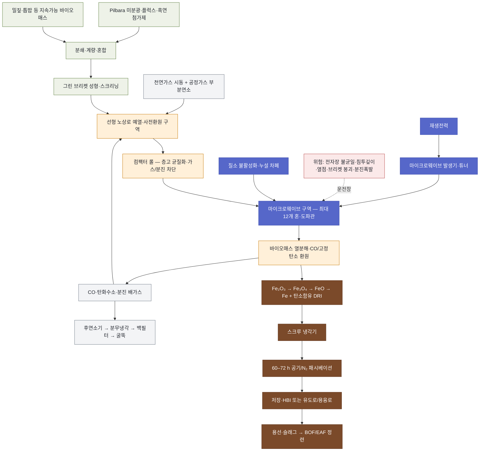

<!-- AUTO-GENERATED BY steel-intelligence. DO NOT EDIT. -->

# 마이크로웨이브·바이오매스 환원제철 (BioIron)

> 조사 기준일: **2026-07-25** · 공식·1차 자료 중심 · 사실과 AI 분석을 구분해 작성

??? info "관련 기술 바로가기 · 현재 위치: 환원·용융 경로"

    탐색을 위한 편의 분류이며 기술 우열이나 확정된 공정 관계를 뜻하지 않습니다.

    **환원·용융 경로**

    [[technologies/TEC-hydrogen-direct-reduced-iron|수소 직접환원철 (Hydrogen DRI)]] · [[technologies/TEC-hydrogen-based-fine-ore-reduction|무펠릿 미분광 수소환원 (Fluidized-bed Hydrogen Reduction)]] · [[technologies/TEC-electric-smelting-furnace|전기용융로 (Electric Smelting Furnace)]] · [[technologies/TEC-hydrogen-plasma-smelting-reduction|수소 플라즈마 용융환원 (HPSR)]] · **마이크로웨이브·바이오매스 환원제철 (BioIron) · 현재**

    **전해 기반 경로**

    [[technologies/TEC-molten-oxide-electrolysis|용융산화물 전기분해 (Molten Oxide Electrolysis)]] · [[technologies/TEC-low-temperature-aqueous-iron-electrolysis|저온 수계 전해제철 (Aqueous Iron Electrolysis)]]

    **기존 설비·순환 경로**

    [[technologies/TEC-blast-furnace-ccus|고로 CCUS]] · [[technologies/TEC-high-grade-eaf-and-scrap-impurity-removal|고급강 EAF·스크랩 불순물 제거]]

    **통합·운영 기술**

    [[technologies/TEC-low-carbon-ironmaking|저탄소 제철 종합 경로 (Low-carbon Ironmaking)]] · [[technologies/TEC-smart-steelworks|스마트 제철소 (Smart Steelworks)]]

{ .steel-media-image .steel-hero-image .steel-media-compact }

*대표 이미지 — US11959153B2 Figure 8: 2 kW 마이크로웨이브 발생기, 자동 튜너, 도파관, PC 제어, 질소 공급·배가스 배출, 내화물과 바이오매스-철광석 브리켓을 포함한 실험 처리장치 (특허 도면 · 권리 `link_only` · 출처 [[sources/SRC-20260725-D965F782|SRC-20260725-D965F782]] · [원문 페이지](https://patents.google.com/patent/US11959153B2/en))*

!!! abstract "한눈에 보기"

    | 항목 | 내용 |
    | --- | --- |
    | **분류 (편집)** | 바이오매스 내장 브리켓의 마이크로웨이브 고체환원 |
    | **핵심 원리** | 철광석 미분과 바이오매스를 브리켓 내부에 혼합하고 무산소 분위기에서 마이크로웨이브로 고체 환원철을 생산하는 공정 [^src-20260725-d965f782] |
    | **운전 온도** | 특허 청구 범위의 hematite 금속화 온도 800~950°C; 설명 실시형태는 최대 1100°C 범위를 제시 [^src-20260725-d965f782] |
    | **제품 형태** | 마이크로웨이브 구역에서 생산되는 고금속화 탄소함유 DRI; 후단 HBI 또는 용선·강으로 전환 필요 [^src-20260725-e5cfe77a] |
    | **적용 원료** | Pilbara 철광석 미분, 바이오매스, 석회석·돌로마이트·마그네사이트계 플럭스와 소량 흑연 첨가제 [^src-20260725-e5cfe77a] |
    | **공개 개발 단계** | 독일 소형 회분 파일럿 성공 후 서호주 1 t/h 연속 파일럿 건설을 추진했으나 2025년 노 설계 문제로 건설 중단; 기술 R&D 지속 [^src-20260725-84498fdf] |

## 개요

철광석 미분과 바이오매스를 브리켓 내부에 혼합하고 무산소 분위기에서 마이크로웨이브로 고체 환원철을 생산하는 공정 [^src-20260725-d965f782]

이 문서는 Rio Tinto BioIron의 공개 특허·독일 소형 파일럿과 건설이 중단된 서호주 1 t/h 선형 노상로 설계를 중심으로 다룹니다. 바이오차를 기존 고로·소결·EAF에 일부 대체 투입하는 일반 바이오매스 활용과, 마이크로웨이브 용융로 자체는 별도 기술입니다.

- **근거 확인 기업:** 1개
- **직접 연결 근거:** 8건

## 작동 원리

- **작동 원리:** 철광석과 바이오매스가 마이크로웨이브를 흡수해 내부 발열하고 바이오매스 열분해 가스와 고정탄소가 산화철을 환원 [^src-20260725-d965f782]

## 공정 구성

**색상 범례 (AI 재구성):** 녹색=원료·브리켓 · 주황=예열·열분해·환원 · 청색=마이크로웨이브·불활성화 · 갈색=DRI·용융 제품 · 회색=연료·배가스 · 적색=확대 운전 위험

!!! note "도식 해석"

    위 흐름도는 서호주 DWER 허가 설계와 BioIron 특허 공정을 기능 단위로 재구성한 것입니다. 실제 1 t/h 노의 배관계장도·전자장 해석·준공도가 아닙니다. [^src-20260725-d965f782]

## 주요 기술 특성

### 반응·셀·공정

| 구분 | 공개된 내용 | 근거 성격 |
| --- | --- | --- |
| **작동 원리** | 철광석과 바이오매스가 마이크로웨이브를 흡수해 내부 발열하고 바이오매스 열분해 가스와 고정탄소가 산화철을 환원 [^src-20260725-d965f782] | 특허 |
| **노형·전극 구성** | 예열·사전환원 구역과 마이크로웨이브 구역으로 나뉜 연속 선형 노상로 설계 [^src-20260725-e5cfe77a] | 인허가 자료 |
| **노 구역 구성** | 전단 재래식 가열 예열·사전환원부와 후단 마이크로웨이브 고금속화부의 2구역 구성 [^src-20260725-e5cfe77a] | 인허가 자료 |
| **선형 노상 이송** | 브리켓을 노상을 따라 연속 이송하고 구역 사이 모터 구동 컴팩터 롤로 층고를 고르게 유지 [^src-20260725-e5cfe77a] | 인허가 자료 |
| **불활성화·전자파 차폐** | 질소로 무산소 분위기를 유지하고 다중 차폐·밀봉으로 마이크로웨이브 누설과 가스·분진 유입을 억제 [^src-20260725-e5cfe77a] | 인허가 자료 |
| **열분해가스 역할** | 바이오매스 열분해가스는 산화철 환원과 예열부 부분·완전 연소 열원으로 활용되며 공정가스 일부는 재순환 [^src-20260725-e5cfe77a] | 인허가 자료 |
| **층고·분포 제어** | 컴팩터 롤이 팬 폭 방향 층 깊이를 균질화하고 마이크로웨이브부로의 가스·분진 유입 억제를 보조 [^src-20260725-e5cfe77a] | 인허가 자료 |
| **마이크로웨이브 전달계** | 마이크로웨이브 발생기-도파관-혼을 통해 이동층 폭에 전자장 에너지를 분배 [^src-20260725-e5cfe77a] | 인허가 자료 |
| **산화철 환원 경로** | XRD에서 hematite→magnetite→wustite→metallic iron의 단계적 고체환원 경로 확인 [^src-20260725-d965f782] | 특허 |

### 원료·운전·제품

| 구분 | 공개된 내용 | 근거 성격 |
| --- | --- | --- |
| **운전 온도** | 특허 청구 범위의 hematite 금속화 온도 800~950°C; 설명 실시형태는 최대 1100°C 범위를 제시 [^src-20260725-d965f782] | 특허 |
| **적용 원료** | Pilbara 철광석 미분, 바이오매스, 석회석·돌로마이트·마그네사이트계 플럭스와 소량 흑연 첨가제 [^src-20260725-e5cfe77a] | 인허가 자료 |
| **제품 형태** | 마이크로웨이브 구역에서 생산되는 고금속화 탄소함유 DRI; 후단 HBI 또는 용선·강으로 전환 필요 [^src-20260725-e5cfe77a] | 인허가 자료 |
| **부산물** | CO·미연탄화수소·타르 가능 성분·분진·슬래그 및 바이오매스 회분 [^src-20260725-e5cfe77a] | 인허가 자료 |
| **바이오매스 역할** | 바이오매스는 주 환원제이며 열분해 가스의 연소열도 예열·사전환원에 이용 가능 [^src-20260725-e5cfe77a] | 인허가 자료 |
| **바이오매스 후보** | 밀짚·보리짚·카놀라 줄기·사탕수수 버개스·벼 줄기·톱밥 등 농업 부산물과 지속가능 에너지작물 [^src-20260725-c925bf86] | 회사 발표 |
| **원료 성형 형태** | 철광석-바이오매스 그린 브리켓을 성형·스크리닝하고 10~20% 예상 미분은 혼합기로 재순환 [^src-20260725-e5cfe77a] | 인허가 자료 |
| **마이크로웨이브 주파수** | 특허 실험은 2450 MHz, 산업 고출력 설계 검토 주파수는 915 MHz [^src-20260725-d965f782] | 특허 |
| **마이크로웨이브 침투깊이** | 특허 실험에서 500°C 초과·915 MHz 조건의 도출 침투깊이 약 5 cm; 5~10 cm 연속 부하 가열 가능성 제시 [^src-20260725-d965f782] | 특허 |
| **부반응·맥석 영향** | 실리카와 산화철의 fayalite 형성이 철 회수·금속화와 후단 슬래그 부하를 악화시킬 수 있음 [^src-20260725-d965f782] | 특허 |
| **DRI 냉각** | 고온 DRI는 스크루 냉각기에서 냉각 후 저장 사일로로 이송 [^src-20260725-e5cfe77a] | 인허가 자료 |
| **DRI 패시베이션** | 냉각 DRI를 공기·질소 혼합가스로 60~72시간 패시베이션하는 허가 설계 [^src-20260725-e5cfe77a] | 인허가 자료 |
| **후단 용융·정련** | DRI 미분을 유도로 또는 별도 용융로에서 녹여 금속과 슬래그를 분리한 뒤 BOF·EAF 정련 [^src-20260725-aee7865a] | 회사 IR |
| **마이크로웨이브 혼 구성** | 서호주 1 t/h 허가 설계는 컨베이어 폭 방향 균일 가열을 위해 최대 12개 마이크로웨이브 혼 배치 [^src-20260725-e5cfe77a] | 인허가 자료 |
| **실험실 시험 규모** | 특허 실험은 540×425×425 mm 멀티모드 캐비티에서 약 27 g·4개 브리켓, 1~2 kW, 1~16분 처리 [^src-20260725-d965f782] | 특허 |

### 에너지·환경·경제

| 구분 | 공개된 내용 | 근거 성격 |
| --- | --- | --- |
| **배가스 처리** | 공정가스 내부 재이용 후 미연탄화수소 후연소, 분무냉각·희석공기, 백필터·배기팬·굴뚝 처리 [^src-20260725-e5cfe77a] | 인허가 자료 |
| **특허 에너지수지** | 소형 비최적 실험의 열손실 보정 추정 1.6 GJ/t product, 무보정 환산 74 GJ/t product, 열손실 약 90%; 2 GJ/t는 산업 최적화 가능성 [^src-20260725-d965f782] | 특허 |
| **전력수요 비교 주장** | Rio Tinto는 BioIron 전력소비가 재생수소 의존 제철 경로의 약 1/3이라고 주장; 실제 연속 플랜트 원단위 미공개 [^src-20260725-c925bf86][^src-20260725-32ea9484] | 회사 발표·회사 IR |
| **배출감축 주장** | 재생전력·빠르게 성장하는 바이오매스의 탄소순환 조건에서 BF-BOF 대비 최대 95% 감축 가능하다는 회사 주장 [^src-20260725-f1d3edea] | 회사 발표 |
| **바이오매스 효율 주장** | Rio Tinto 2024 자료는 다른 바이오차 경로 대비 원시 바이오매스 사용량 1/3~1/4을 주장 [^src-20260725-f1d3edea][^src-20260725-32ea9484] | 회사 발표·회사 IR |
| **바이오매스 지속가능성 경계** | 구목·고보전가치 산림 벌목을 지원하는 원료를 배제하고 농업 부산물·에너지작물 인증과 토지이용 변화를 검증해야 함 [^src-20260725-4c776b11] | 회사 발표 |
| **전자파 안전** | 마이크로웨이브 누설 차폐, 노 후드 공랭, 호주 전자파 안전기준과 방사선 규제기관 통보가 필요한 설비 [^src-20260725-e5cfe77a] | 인허가 자료 |
| **분진폭발 위험** | 저밀도 바이오매스 분쇄·이송·저장 과정의 가연성 분진과 점화원 통제가 요구됨 [^src-20260725-e5cfe77a] | 인허가 자료 |
| **허가 설계 폐기물 추정** | 허가 설계 추정 연간 슬래그 700 t, 바이오매스 분진 168 t, 노 배가스 분진 72 t, 규격외 DRI 675 t [^src-20260725-e5cfe77a] | 인허가 자료 |

### 실증·산업화

| 구분 | 공개된 내용 | 근거 성격 |
| --- | --- | --- |
| **공개 개발 단계** | 독일 소형 회분 파일럿 성공 후 서호주 1 t/h 연속 파일럿 건설을 추진했으나 2025년 노 설계 문제로 건설 중단; 기술 R&D 지속 [^src-20260725-84498fdf] | 회사 IR |
| **상용 규모 확대 조건** | 새 노 설계, 이동층 전자장 균일도, 브리켓 붕괴·층고 제어, 금속화·철수율, 배가스·분진, 혼·차폐 내구성과 실제 에너지수지 검증 필요 [^src-20260725-c925bf86] | 회사 발표 |
| **공개 성과의 한계** | 1 t/h·연 2,000 h·12개 혼·폐기물 수치는 허가·설계값이며 실제 준산업 연속운전 실적이 아님 [^src-20260725-e5cfe77a] | 인허가 자료 |
| **파일럿 회분 투입량** | 독일 소형 파일럿은 골프공 크기 철광석-바이오매스 브리켓 1,000개씩 회분 처리 [^src-20260725-4c776b11] | 회사 발표 |
| **연간 계획 운전시간** | 서호주 허가 설계의 연간 계획 운전시간 약 2,000 h [^src-20260725-e5cfe77a] | 인허가 자료 |
| **파일럿 캠페인 일정** | 8주 운전 캠페인 후 3주 설비 개조 정지를 반복하는 R&D 운전 계획 [^src-20260725-e5cfe77a] | 인허가 자료 |
| **노 설계 확대 위험** | 현재 노 설계는 기술 위험 최소화와 성능 최적화를 위한 추가 개발이 필요하다는 Rio Tinto 공식 판단 [^src-20260725-c925bf86] | 회사 발표 |
| **건설 중단 후 R&D** | 파일럿 건설은 중단됐지만 University of Nottingham·Metso와 BioIron 기술개발은 계속 [^src-20260725-c925bf86] | 회사 발표 |

## 공개 개발 연혁

| 날짜 | 공개 사건 |
| --- | --- |
| 2022-11-23 | Rio Tinto BioIron proves successful for low-carbon iron-making [^src-20260725-4c776b11] |
| 2023-12-06 | Introduction to BioIron - Investor Seminar 2023 [^src-20260725-aee7865a] |
| 2024-04-16 | US11959153B2 Production of iron [^src-20260725-d965f782] |
| 2024-06-04 | Rio Tinto develops BioIron R&D facility in Western Australia [^src-20260725-f1d3edea] |
| 2024-12-31 | Decarbonising the steel value chain 2024 [^src-20260725-32ea9484] |
| 2025-07-28 | BioIron Pilot Plant Works Approval W6964/2024/1 Decision Report [^src-20260725-e5cfe77a] |
| 2025-11-17 | Rio Tinto pauses BioIron pilot construction [^src-20260725-c925bf86] |

## 설비·공정 이미지

{ .steel-media-image .steel-media-compact }

**특허 도면.** US11959153B2 Figure 14: 철광석-바이오매스 브리켓, 예열부, 마이크로웨이브·질소 공급 반응실, 배가스 및 고체 환원철 배출의 특허 공정 블록도

- 출처 [[sources/SRC-20260725-D965F782|SRC-20260725-D965F782]] · 권리 `link_only` · [원문 페이지](https://patents.google.com/patent/US11959153B2/en) · 작성·촬영 Rio Tinto Services Limited / Michael Buckley
- 권리 메모: 특허 원문의 Figure 14를 원격 링크로만 표시합니다. 서호주 파일럿의 실제 배관계장도 또는 준공도가 아닙니다.

## 기업별 상세 현황

### [[companies/COM-Rio-Tinto|Rio Tinto]]

**확인된 현황.** BioIron 1 t/h 파일럿 건설은 노 설계의 기술·설계 과제로 중단; University of Nottingham·Metso와 장기 기술 R&D는 지속 [^src-20260725-c925bf86][^src-20260725-84498fdf]

**단계 판단: 중단·연기 신호.** 공식 발표에 실행 차질이 명시된 상태이므로 기존 목표 일정과 투자 지속 여부를 우선 재확인해야 합니다.

- **날짜:** 발표 2025-11-17 · 수집 2026-07-25 · 검증 2026-07-25

## 관련 프로젝트

기술의 실제 확대 단계를 확인할 수 있도록 프로젝트 문서와 현재 상태를 직접 연결합니다. 각 프로젝트 문서에는 최근 상태뿐 아니라 확인 가능한 전체 일정 이력이 표시됩니다.

| 프로젝트 | 현재 확인 상태 | 일정·규모 |
| --- | --- | --- |
| **[[projects/PRJ-BIOIRON-WA-RD|BioIron 연구개발 시설 (Western Australia)]]** | 서호주 1 t/h BioIron 파일럿 건설은 노 설계의 기술·설계 과제로 중단; University of Nottingham·Metso와 기술 R&D는 지속 [^src-20260725-c925bf86] | **시간당 처리능력** 약 1 tonne iron product/h 계획 [^src-20260725-e5cfe77a] |

## 기술적 쟁점과 미공개 데이터

!!! warning "AI 분석 — 공개 근거와 구분"

    기업별 단계는 인용된 공식 발표 문구를 기준으로 분류한 것으로, 정식 TRL 판정이나 기술 경쟁력 순위가 아닙니다.

- **추가 확인이 필요한 데이터:** 중단된 1 t/h 설계의 재개 또는 대체 노형, 최대 12개 혼의 실제 전자장 균일도, 연속 브리켓 이송·붕괴율, 금속화율·철 수율·제품 탄소, 전력·천연가스·바이오매스 원단위, 타르·분진·슬래그, 지속가능성 인증과 후단 용융 품질을 확인해야 합니다.
- 기업 간 비교에는 시험 규모, 실제 투입 원료·에너지 조건, 상용 운전 실적과 제품 단위 배출량을 같은 기준으로 적용해야 합니다.
- BioIron의 핵심은 바이오매스를 외부 가스화해 환원가스를 보내는 방식이 아니라, 광석 미분과 바이오매스를 브리켓 내부에 밀착시켜 열분해 가스·고정탄소의 확산거리를 줄이는 것입니다. 브리켓 밀도·기공률·수분·바인더·압축강도는 전자장 흡수와 가스 배출, 붕괴·분진을 동시에 좌우합니다.
- 마이크로웨이브는 노벽부터 전도하는 열이 아니라 유전손실을 통해 원료 내부에 열을 만들 수 있지만, ‘균일 체적가열’이 자동으로 보장되지는 않습니다. 광석 상변화·수분 제거·바이오매스 열분해에 따라 유전특성이 계속 바뀌므로 반사전력·정재파·열점과 냉점을 실시간으로 제어해야 합니다.
- 특허가 제시한 915 MHz에서 약 5 cm 침투깊이와 5–10 cm 연속 부하 가능성은 실험에서 도출한 설계 근거입니다. 서호주 설계의 최대 12개 혼과 층고 균질화 롤은 넓은 노상 전체에 에너지를 고르게 전달하려는 대응이며, 장기 연속 균일도·혼 수명·오염에 대한 실적은 공개되지 않았습니다.
- 바이오매스는 100–500°C 구간에서 건조·열분해되어 수증기·타르·탄화수소·CO와 고정탄소를 만듭니다. 환원 반응은 Fe₂O₃→Fe₃O₄→FeO→Fe로 진행하지만 실리카와 산화철이 fayalite를 만들면 철 회수·금속화와 후단 슬래그 부하가 악화될 수 있습니다.
- 서호주 허가 설계는 ‘마이크로웨이브만으로 가열’하는 단순 공정이 아닙니다. 천연가스 시동, 열분해가스의 부분·완전 연소, 공정가스 재순환, 후연소기와 유도로가 포함됩니다. 전력·천연가스·바이오탄소·후단 용융을 모두 포함한 톤당 에너지·배출 경계가 필요합니다.
- 특허의 1.6 GJ/t 열손실 보정치와 약 2 GJ/t 산업 최적화 가능치는 실증 원단위가 아닙니다. 같은 실험의 무보정 환산치는 74 GJ/t product이고 열손실이 약 90%였으므로, 숫자 하나만 떼어 상용 효율로 인용하면 안 됩니다.
- 2024년 회사의 ‘수소 기반 경로 대비 전력 약 1/3’과 ‘BF–BOF 대비 최대 95% 감축’은 조건부 비교 주장입니다. 재생전력, 빠르게 자라는 지속가능 바이오매스, 토지이용 변화, 운송·건조, 후단 용융, 바이오탄소 회계와 CCS 여부를 동일 경계에서 검증해야 합니다.
- 제품은 고금속화 탄소함유 DRI이며 자연발화 위험 때문에 냉각·60–72시간 패시베이션이 계획됐습니다. 냉간 저장은 조업 유연성을 주지만 현열을 잃고 재산화 위험이 생기므로, HBI화·고온 직송·후단 용융 중 최적 물류를 별도로 비교해야 합니다.
- 서호주 파일럿은 8주 캠페인 뒤 3주 개조정지, 연 2,000시간 운전 계획이었습니다. 이는 상업 플랜트 가동률이 아니라 반복 설계변경을 전제로 한 R&D 계획이며, 2025년 건설 중단은 바로 노 설계 확대 위험이 해소되지 않았음을 보여줍니다.
- 2025년 중단은 기술 폐기를 뜻하지 않지만 2026년 시운전 계획은 더 이상 현재 일정이 아닙니다. 시설 건설과 기술 R&D를 분리해, 다음 판단 기준을 새 노 설계 공개·연속 브리켓 이송·전자장 균일도·가스/분진 관리·실제 금속화율과 철 수율로 두어야 합니다.

## POSCO 관점 시사점

!!! info "AI 분석 — 전략 검토용"

    다음 내용은 공개 근거를 바탕으로 한 비교 분석이며, POSCO의 공식 결정이나 투자 권고가 아닙니다.

- BioIron은 HyREX와 마찬가지로 Pilbara급 미분·중저품위 원료의 펠릿 의존도를 낮추려는 경로지만, 환원제·열전달·제품 형태가 다릅니다. POSCO는 동일 광종으로 전처리 에너지, 금속화율, 철 수율, 슬래그량, 후단 용융 전력을 비교해야 합니다.
- 브리켓 내부 환원은 FINEX·HyREX의 미분 유동층과 달리 원료 성형을 다시 도입합니다. 기존 제철소의 브리켓·분진 재활용 경험을 활용할 수 있으나, 농업잔사 계절성·회분·알칼리·염소·수분과 장거리 물류는 별도 공급망 리스크입니다.
- 마이크로웨이브 발생기·도파관·혼·차폐·반사전력 계측은 기존 전기로 전력설비와 다른 역량입니다. 시험한다면 작은 회분 실험보다 연속 이동층에서 층고·상변화에 따른 전자장 분포와 브리켓 온도 편차를 계측하는 것이 우선입니다.
- 현재 단계에서는 BioIron을 HyREX 대체 상용안으로 보기보다, 저수소 지역의 장기 선택지이자 바이오탄소·마이크로웨이브 결합 벤치마크로 관리하는 편이 타당합니다. 재개 조건은 신규 노 설계, 지속 운전시간, 전력·바이오매스 원단위, LCA, 후단 용융 제품 품질의 공개입니다.

## 출처

- [[sources/SRC-20260725-32EA9484|Decarbonising the steel value chain 2024]] — Rio Tinto, 2024-12-31 · [원문](https://www.riotinto.com/-/media/content/documents/sustainability/climate-change/decarbonising-steel-value-chain-2024.pdf?rev=b75e4ed6640c46a593c6c9b9abcca0cc)
- [[sources/SRC-20260725-4C776B11|Rio Tinto BioIron proves successful for low-carbon iron-making]] — Rio Tinto, 2022-11-23 · [원문](https://www.riotinto.com/en/news/releases/2022/rio-tintos-bioiron-proves-successful-for-low-carbon-iron-making)
- [[sources/SRC-20260725-84498FDF|Rio Tinto climate reporting: 2025 progress and 2026 action]] — Rio Tinto, 게시일 미상 · [원문](https://www.riotinto.com/en/invest/reports/climate-reporting)
- [[sources/SRC-20260725-AEE7865A|Introduction to BioIron - Investor Seminar 2023]] — Rio Tinto, 2023-12-06 · [원문](https://www.riotinto.com/-/media/content/documents/invest/presentations/2023/rt-investor-seminar-2023-script.pdf)
- [[sources/SRC-20260725-C925BF86|Rio Tinto pauses BioIron pilot construction]] — Rio Tinto, 2025-11-17 · [원문](https://www.riotinto.com/en/news/releases/2025/rio-tinto-partners-with-calix-to-test-low-emissions-steel-making-in-western-australia-pauses-bioiron)
- [[sources/SRC-20260725-D965F782|US11959153B2 Production of iron]] — United States Patent and Trademark Office / Google Patents, 2024-04-16 · [원문](https://patents.google.com/patent/US11959153B2/en)
- [[sources/SRC-20260725-E5CFE77A|BioIron Pilot Plant Works Approval W6964/2024/1 Decision Report]] — Western Australia Department of Water and Environmental Regulation, 2025-07-28 · [원문](https://www.der.wa.gov.au/images/documents/our-work/licences-and-works-approvals/Decisions_/W6964/W6964%2028-07-2025%20DR.pdf)
- [[sources/SRC-20260725-F1D3EDEA|Rio Tinto develops BioIron R&D facility in Western Australia]] — Rio Tinto, 2024-06-04 · [원문](https://www.riotinto.com/news/releases/2024/rio-tinto-to-develop-bioiron-rd-facility-in-western-australia-to-test-low-carbon-steelmaking)

[^src-20260725-32ea9484]: **Decarbonising the steel value chain 2024** — Rio Tinto, 2024-12-31. [원문](https://www.riotinto.com/-/media/content/documents/sustainability/climate-change/decarbonising-steel-value-chain-2024.pdf?rev=b75e4ed6640c46a593c6c9b9abcca0cc) · [[sources/SRC-20260725-32EA9484|보관 원문·메타데이터]]
[^src-20260725-4c776b11]: **Rio Tinto BioIron proves successful for low-carbon iron-making** — Rio Tinto, 2022-11-23. [원문](https://www.riotinto.com/en/news/releases/2022/rio-tintos-bioiron-proves-successful-for-low-carbon-iron-making) · [[sources/SRC-20260725-4C776B11|보관 원문·메타데이터]]
[^src-20260725-84498fdf]: **Rio Tinto climate reporting: 2025 progress and 2026 action** — Rio Tinto, 게시일 미상. [원문](https://www.riotinto.com/en/invest/reports/climate-reporting) · [[sources/SRC-20260725-84498FDF|보관 원문·메타데이터]]
[^src-20260725-aee7865a]: **Introduction to BioIron - Investor Seminar 2023** — Rio Tinto, 2023-12-06. [원문](https://www.riotinto.com/-/media/content/documents/invest/presentations/2023/rt-investor-seminar-2023-script.pdf) · [[sources/SRC-20260725-AEE7865A|보관 원문·메타데이터]]
[^src-20260725-c925bf86]: **Rio Tinto pauses BioIron pilot construction** — Rio Tinto, 2025-11-17. [원문](https://www.riotinto.com/en/news/releases/2025/rio-tinto-partners-with-calix-to-test-low-emissions-steel-making-in-western-australia-pauses-bioiron) · [[sources/SRC-20260725-C925BF86|보관 원문·메타데이터]]
[^src-20260725-d965f782]: **US11959153B2 Production of iron** — United States Patent and Trademark Office / Google Patents, 2024-04-16. [원문](https://patents.google.com/patent/US11959153B2/en) · [[sources/SRC-20260725-D965F782|보관 원문·메타데이터]]
[^src-20260725-e5cfe77a]: **BioIron Pilot Plant Works Approval W6964/2024/1 Decision Report** — Western Australia Department of Water and Environmental Regulation, 2025-07-28. [원문](https://www.der.wa.gov.au/images/documents/our-work/licences-and-works-approvals/Decisions_/W6964/W6964%2028-07-2025%20DR.pdf) · [[sources/SRC-20260725-E5CFE77A|보관 원문·메타데이터]]
[^src-20260725-f1d3edea]: **Rio Tinto develops BioIron R&D facility in Western Australia** — Rio Tinto, 2024-06-04. [원문](https://www.riotinto.com/news/releases/2024/rio-tinto-to-develop-bioiron-rd-facility-in-western-australia-to-test-low-carbon-steelmaking) · [[sources/SRC-20260725-F1D3EDEA|보관 원문·메타데이터]]
