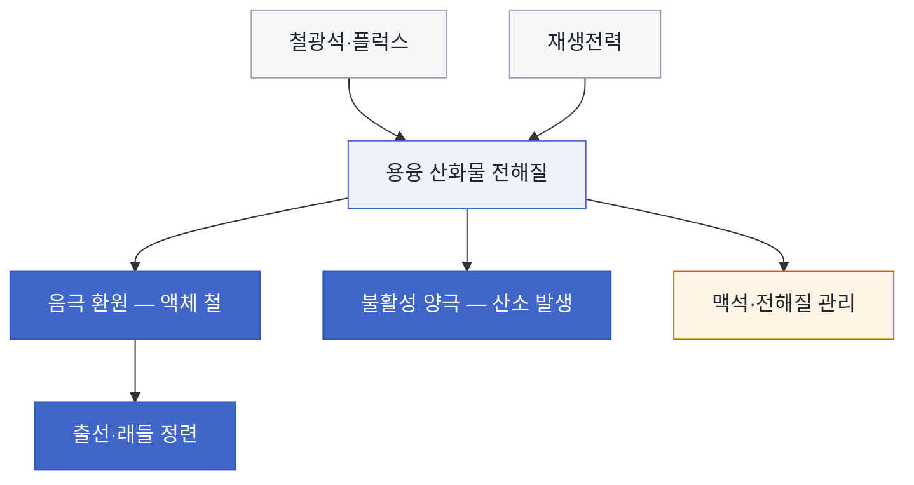

<!-- AUTO-GENERATED BY steel-intelligence. DO NOT EDIT. -->

# 용융산화물 전기분해 (Molten Oxide Electrolysis)

> 조사 기준일: **2026-07-25** · 공식·1차 자료 중심 · 사실과 AI 분석을 구분해 작성

??? info "관련 기술 바로가기 · 현재 위치: 전해 기반 경로"

    탐색을 위한 편의 분류이며 기술 우열이나 확정된 공정 관계를 뜻하지 않습니다.

    **환원·용융 경로**

    [[technologies/TEC-hydrogen-direct-reduced-iron|수소 직접환원철 (Hydrogen DRI)]] · [[technologies/TEC-hydrogen-based-fine-ore-reduction|무펠릿 미분광 수소환원 (Fluidized-bed Hydrogen Reduction)]] · [[technologies/TEC-electric-smelting-furnace|전기용융로 (Electric Smelting Furnace)]] · [[technologies/TEC-hydrogen-plasma-smelting-reduction|수소 플라즈마 용융환원 (HPSR)]] · [[technologies/TEC-microwave-biomass-ironmaking|마이크로웨이브·바이오매스 환원제철 (BioIron)]]

    **전해 기반 경로**

    **용융산화물 전기분해 (Molten Oxide Electrolysis) · 현재** · [[technologies/TEC-low-temperature-aqueous-iron-electrolysis|저온 수계 전해제철 (Aqueous Iron Electrolysis)]]

    **기존 설비·순환 경로**

    [[technologies/TEC-blast-furnace-ccus|고로 CCUS]] · [[technologies/TEC-high-grade-eaf-and-scrap-impurity-removal|고급강 EAF·스크랩 불순물 제거]]

    **통합·운영 기술**

    [[technologies/TEC-low-carbon-ironmaking|저탄소 제철 종합 경로 (Low-carbon Ironmaking)]] · [[technologies/TEC-smart-steelworks|스마트 제철소 (Smart Steelworks)]]

{ .steel-media-image .steel-hero-image .steel-media-compact }

*대표 이미지 — Boston Metal Woburn 다중 불활성 양극 MOE 셀의 2025년 2월 용융금속 출선 장면 (실제 설비 사진 · 권리 `link_only` · 출처 [[sources/SRC-20260725-3C2197EF|SRC-20260725-3C2197EF]] · [원문 페이지](https://www.bostonmetal.com/news/boston-metal-celebrates-historic-commissioning-run-of-moe-green-steel-cell))*

!!! abstract "한눈에 보기"

    | 항목 | 내용 |
    | --- | --- |
    | **분류 (편집)** | 고온 직접 전해 기반 1차 철 생산 |
    | **핵심 원리** | 철광석의 산화철을 용융 산화물 전해질에 녹이고, 전자를 환원제로 사용해 음극에서 액체 철을 만들며 불활성 양극에서 산소를 발생시키는 직접 전해 제철 경로 [^src-20260725-26ea1cbd] |
    | **운전 온도** | Boston Metal의 고온 MOE Steel 경로는 약 1,600°C에서 운전한다. [^src-20260725-26ea1cbd] |
    | **제품 형태** | 고순도 액체 철을 직접 생산한다. [^src-20260725-26ea1cbd] |
    | **적용 원료** | Boston Metal은 모든 등급의 철광석을 직접 투입할 수 있고 소결·펠릿화 전처리를 생략할 수 있다고 설명한다. [^src-20260725-26ea1cbd] |
    | **전력원단위 추정** | 성숙 설비를 가정한 문헌 추정치는 2.89–4.45 kWh/kg-Fe이며, 별도 모델은 약 4.7–4.78 kWh/kg-Fe를 제시한다. [^src-20260725-1ad87d2b] |
    | **공개 개발 단계** | 2025년 Boston Metal Woburn의 다중 불활성 양극 산업 셀에서 톤 단위 철 출선이 확인됐으나, 별도의 제철 실증 플랜트는 향후 단계로 제시됐다. [^src-20260725-3c2197ef] |
    | **후단 활용** | 출선한 액체 철은 래들 정련으로 직접 이송할 수 있다. [^src-20260725-26ea1cbd] |

## 개요

철광석의 산화철을 용융 산화물 전해질에 녹이고, 전자를 환원제로 사용해 음극에서 액체 철을 만들며 불활성 양극에서 산소를 발생시키는 직접 전해 제철 경로 [^src-20260725-26ea1cbd]

이 문서는 1,600°C 안팎에서 액체 철을 직접 생산하는 산업화 경로와, 더 낮은 온도에서 고체 철을 얻는 학술 변형을 구분해 다룹니다.

- **근거 확인 기업:** 3개
- **직접 연결 근거:** 9건

## 작동 원리

- **총괄 반응:** Fe2O3를 전기분해해 2Fe와 3/2 O2로 분리하며, 음극에서 Fe3+가 전자를 받아 철이 되고 양극에서 산화물 이온이 산소를 방출한다. [^src-20260725-cedc4521]
- **전해 셀 구성:** 용융 산화물 전해질에 불활성 양극을 담그고 셀 바닥의 액체 철 풀을 음극이자 제품 수집부로 사용하는 전해 셀이다. [^src-20260725-26ea1cbd]

## 공정 구성

**색상 범례 (AI 의미 그룹):** 회색=투입 · 옅은 코발트=전해 공정 · 진한 코발트=제품·후단 · 황색=운영 쟁점

!!! note "도식 해석"

    위 흐름도는 공개 자료의 단계를 비교하기 쉽게 재구성한 것입니다. 실제 물질수지·전해액 조성·셀 배열을 뜻하는 설계도는 아닙니다. [^src-20260725-26ea1cbd][^src-20260725-cedc4521]

## 주요 기술 특성

### 반응·셀·공정

| 구분 | 공개된 내용 | 근거 성격 |
| --- | --- | --- |
| **총괄 반응** | Fe2O3를 전기분해해 2Fe와 3/2 O2로 분리하며, 음극에서 Fe3+가 전자를 받아 철이 되고 양극에서 산화물 이온이 산소를 방출한다. [^src-20260725-cedc4521] | 정부·공공자료 |
| **전해 셀 구성** | 용융 산화물 전해질에 불활성 양극을 담그고 셀 바닥의 액체 철 풀을 음극이자 제품 수집부로 사용하는 전해 셀이다. [^src-20260725-26ea1cbd] | 회사 발표 |
| **양극 재료** | Cr 기반 합금 불활성 양극은 전도성 Cr(III)-Al 산화물 보호층을 형성해 제한된 소모로 산소를 발생시킬 수 있다. [^src-20260725-147875e9] | 학술지 논문 |
| **양극 내구성** | Ir 양극 소모는 고-CaO 염기성 전해질에서 고-SiO2 산성 전해질보다 약 20배 높게 측정되어, 전해질 조성이 양극 수명을 크게 좌우한다. [^src-20260725-1a6afbf8] | 학술지 논문 |
| **운전 방식** | 연속 운전 중 액체 철을 반복 출선하며, 셀 안의 양극 수와 플랜트의 셀 수를 늘리는 모듈식 증설 구조다. [^src-20260725-cedc4521] | 정부·공공자료 |

### 원료·운전·제품

| 구분 | 공개된 내용 | 근거 성격 |
| --- | --- | --- |
| **운전 온도** | Boston Metal의 고온 MOE Steel 경로는 약 1,600°C에서 운전한다. [^src-20260725-26ea1cbd] | 회사 발표 |
| **저온 학술 변형 온도** | 서울대의 B2O3-Na2O 저온 MOE 실험은 1173 K(900°C)에서 수행됐다. [^src-20260725-1486633e] | 학술지 논문 |
| **적용 원료** | Boston Metal은 모든 등급의 철광석을 직접 투입할 수 있고 소결·펠릿화 전처리를 생략할 수 있다고 설명한다. [^src-20260725-26ea1cbd] | 회사 발표 |
| **제품 형태** | 고순도 액체 철을 직접 생산한다. [^src-20260725-26ea1cbd] | 회사 발표 |
| **부산물** | 불활성 양극에서 산소 가스가 발생한다. [^src-20260725-cedc4521] | 정부·공공자료 |
| **후단 활용** | 출선한 액체 철은 래들 정련으로 직접 이송할 수 있다. [^src-20260725-26ea1cbd] | 회사 발표 |

### 에너지·환경·경제

| 구분 | 공개된 내용 | 근거 성격 |
| --- | --- | --- |
| **전류효율** | 1.6 V 저온 MOE 실험에서 시약 산화철의 전류 효율은 공기 중 65.50–68.72%, Ar 중 67.49–78.56%였고, 철광석 시료는 공기 중 64.14–67.58%였다. [^src-20260725-1486633e] | 학술지 논문 |
| **전력원단위 추정** | 성숙 설비를 가정한 문헌 추정치는 2.89–4.45 kWh/kg-Fe이며, 별도 모델은 약 4.7–4.78 kWh/kg-Fe를 제시한다. [^src-20260725-1ad87d2b] | 학술지 논문 |
| **배출 경계** | Boston Metal은 재생전력을 사용할 경우 탄소 환원제 없이 공정에서 직접 CO2를 발생시키지 않는다고 설명한다. 전력 공급망 배출은 이 주장과 별도로 평가해야 한다. [^src-20260725-26ea1cbd] | 회사 발표 |
| **필요 인프라** | UNIDO·Agora 시나리오는 MOE 조강 1톤당 12.4–14.8 GJ의 전력을 가정하며, 대규모 저탄소 전력 공급과 저장·계통 인프라가 필요할 수 있다. [^src-20260725-4e9ee842] | 정부·공공자료 |
| **경제성 평가** | UNIDO·Agora의 2050 시나리오는 MOE 생산비를 조강 톤당 582–766달러로 추정한다. 상업 실측 원가가 아닌 모델 값이다. [^src-20260725-4e9ee842] | 정부·공공자료 |

### 실증·산업화

| 구분 | 공개된 내용 | 근거 성격 |
| --- | --- | --- |
| **공개 개발 단계** | 2025년 Boston Metal Woburn의 다중 불활성 양극 산업 셀에서 톤 단위 철 출선이 확인됐으나, 별도의 제철 실증 플랜트는 향후 단계로 제시됐다. [^src-20260725-3c2197ef] | 회사 발표 |
| **연속운전 결과** | DOE 프로젝트에서 10 kg 철 생산과 산소 발생을 확인했지만, 100 kg을 1주 동안 생산하려던 내구 캠페인은 생산량과 기간 모두 목표에 미달했다. [^src-20260725-cedc4521] | 정부·공공자료 |
| **상용화 모델** | Boston Metal은 철강사에 MOE 기술을 라이선스하고 핵심 금속 불활성 양극을 공급하는 사업 모델을 제시한다. [^src-20260725-26ea1cbd] | 회사 발표 |

## 공개 개발 연혁

| 날짜 | 공개 사건 |
| --- | --- |
| 2011-08-05 | Electrolysis of Molten Iron Oxide with an Iridium Anode: The Role of Electrolyte Basicity [^src-20260725-1a6afbf8] |
| 2013-05-08 | A new anode material for oxygen evolution in molten oxide electrolysis [^src-20260725-147875e9] |
| 2023-01-27 | ArcelorMittal invests $36 million in Boston Metal [^src-20260725-9d378e7f] |
| 2024-08-05 | Economics of Electrowinning Iron from Ore for Green Steel Production [^src-20260725-1ad87d2b] |
| 2025-03-12 | Boston Metal Celebrates Historic Commissioning Run of MOE Green Steel Cell [^src-20260725-3c2197ef] |
| 2026-07-07 | Production of Fe metal from Fe ores through novel molten oxide electrolysis at 1173 K [^src-20260725-1486633e] |

## 기업별 상세 현황

### [[companies/COM-POSCO|POSCO]]

**확인된 현황.** POSCO 프로젝트 2022Z001이 서울대의 900°C 저온 MOE 학술 연구를 지원했다. 이 출처만으로 POSCO 자체 MOE 파일럿 설비 운전은 확인되지 않는다. [^src-20260725-1486633e]

**단계 판단: 연구·실증.** 기술 가능성을 검증하는 단계입니다. 시험 규모의 성공을 상용 생산성과로 해석하지 않고 규모 확대 계획을 따로 확인해야 합니다.

- **날짜:** 발표 2026-07-07 · 수집 2026-07-25 · 검증 2026-07-25

### [[companies/COM-ArcelorMittal|ArcelorMittal]]

**확인된 현황.** Boston Metal MOE에 $36m 전략 투자; 자체 상용 설비가 아닌 외부 기술 투자 단계 [^src-20260725-9d378e7f]

**단계 판단: 계획·투자.** 기업의 방향성과 자원 투입 의지는 확인되지만 실제 설비 성능이나 상용 운전이 입증된 단계는 아닙니다.

- **날짜:** 발표 2023-01-27 · 수집 2026-07-25 · 검증 2026-07-25

### [[companies/COM-Boston-Metal|Boston Metal]]

**확인된 현황.** 2025년 Woburn 다중 불활성 양극 산업 셀을 가동해 톤 단위 철 출선을 확인했다. 상업 제철소 규모의 연속 운전은 아직 확인되지 않았다. [^src-20260725-3c2197ef]

**단계 판단: 가동·현장 적용.** 연구 발표를 넘어 설비 가동 또는 생산현장 적용이 확인됩니다. 다만 이용률과 제품 단위 성과는 별도 운전 데이터로 검증해야 합니다.

- **날짜:** 발표 2025-03-12 · 수집 2026-07-25 · 검증 2026-07-25

## 관련 프로젝트

기술의 실제 확대 단계를 확인할 수 있도록 프로젝트 문서와 현재 상태를 직접 연결합니다. 각 프로젝트 문서에는 최근 상태뿐 아니라 확인 가능한 전체 일정 이력이 표시됩니다.

| 프로젝트 | 현재 확인 상태 | 일정·규모 |
| --- | --- | --- |
| **[[projects/PRJ-BOSTON-METAL-MOE-WOBURN|Boston Metal Woburn MOE 산업 셀]]** | 다중 불활성 양극 산업 셀 가동과 톤 단위 철 출선이 확인됐으며, 별도 제철 실증 플랜트는 향후 단계다. [^src-20260725-3c2197ef] | - |

## 기술적 쟁점과 미공개 데이터

!!! warning "AI 분석 — 공개 근거와 구분"

    기업별 단계는 인용된 공식 발표 문구를 기준으로 분류한 것으로, 정식 TRL 판정이나 기술 경쟁력 순위가 아닙니다.

- **추가 확인이 필요한 데이터:** 투자·제휴 발표와 자체 설비 운영을 구분하고, 셀 규모, 연속 운전시간, 제품 품질과 상용 설비 착공 여부를 확인해야 합니다.
- 기업 간 비교에는 시험 규모, 실제 투입 원료·에너지 조건, 상용 운전 실적과 제품 단위 배출량을 같은 기준으로 적용해야 합니다.
- 2025년 다중 양극 셀의 톤 단위 출선은 단일 양극·kg급 시험보다 진전된 근거지만, 연속 캠페인 시간·전류효율·양극 마모율·연산 환산능력이 공개되지 않아 상용성 입증과는 구분해야 합니다.
- 광석 품위 유연성은 펠릿·수소 인프라 의존을 줄일 잠재력이 있으나, 맥석이 전해질 조성·점도·전도도·양극 부식과 부산물 처리에 미치는 영향까지 닫힌 물질수지로 검증되어야 합니다.
- 경제성은 전력가격뿐 아니라 전류효율, 셀 가동률, 양극·내화물 수명, 출선당 생산성에 민감합니다. 산소와 슬래그 판매수익은 대규모 시장에서 보수적으로 평가하는 편이 타당합니다.

## POSCO 관점 시사점

!!! info "AI 분석 — 전략 검토용"

    다음 내용은 공개 근거를 바탕으로 한 비교 분석이며, POSCO의 공식 결정이나 투자 권고가 아닙니다.

- HyREX와 달리 수소 제조·저장·수송을 생략할 수 있어 장기 대안 포트폴리오의 옵션 가치가 있습니다. 대신 고온 전해 셀과 불활성 양극의 기술위험이 더 큽니다.
- POSCO 지원 서울대 연구는 900°C급 저온 MOE의 별도 연구축을 보여줍니다. Boston Metal의 액체 철 경로와 제품 형태·후단 공정이 다르므로 동일 성숙도 선상에서 직접 비교하면 안 됩니다.
- 우선 모니터링 지표는 셀당 정격 전류와 생산량, 1회 연속운전 시간, 전류효율, kWh/t-Fe, 양극 마모율, 맥석 허용범위, 제품 불순물, 첫 독립 실증부지와 라이선스 계약입니다.

## 출처

- [[sources/SRC-20260725-147875E9|A new anode material for oxygen evolution in molten oxide electrolysis]] — Nature, 2013-05-08 · [원문](https://www.nature.com/articles/nature12134)
- [[sources/SRC-20260725-1486633E|Production of Fe metal from Fe ores through novel molten oxide electrolysis at 1173 K]] — Scientific Reports, 2026-07-07 · [원문](https://www.nature.com/articles/s41598-026-58521-y)
- [[sources/SRC-20260725-1A6AFBF8|Electrolysis of Molten Iron Oxide with an Iridium Anode: The Role of Electrolyte Basicity]] — Journal of The Electrochemical Society, 2011-08-05 · [원문](https://web.mit.edu/dsadoway/www/137.pdf)
- [[sources/SRC-20260725-1AD87D2B|Economics of Electrowinning Iron from Ore for Green Steel Production]] — Journal of Sustainable Metallurgy, 2024-08-05 · [원문](https://link.springer.com/article/10.1007/s40831-024-00878-3)
- [[sources/SRC-20260725-26EA1CBD|MOE Steel: process, scale-up model, and current deployment status]] — Boston Metal, 게시일 미상 · [원문](https://www.bostonmetal.com/moe-steel/)
- [[sources/SRC-20260725-3C2197EF|Boston Metal Celebrates Historic Commissioning Run of MOE Green Steel Cell]] — Boston Metal, 2025-03-12 · [원문](https://www.bostonmetal.com/news/boston-metal-celebrates-historic-commissioning-run-of-moe-green-steel-cell/)
- [[sources/SRC-20260725-4E9EE842|Low-carbon technologies for the global steel transformation: Molten oxide electrolysis]] — UNIDO / Agora Industry, 게시일 미상 · [원문](https://decarbonization.unido.org/wp-content/uploads/2025/08/a-ind_324_low-carbon-technologies_web.pdf)
- [[sources/SRC-20260725-9D378E7F|ArcelorMittal invests $36 million in Boston Metal]] — ArcelorMittal, 2023-01-27 · [원문](https://corporate.arcelormittal.com/media/news/regulatory-news/arcelormittal-invests-36-million-in-steel-decarbonisation-disruptor-boston-metal)
- [[sources/SRC-20260725-CEDC4521|Carbon-free Iron for a Sustainable Future: Boston Metal IEDO Peer Review]] — U.S. Department of Energy IEDO / Boston Metal, 게시일 미상 · [원문](https://www1.eere.energy.gov/iedo/downloads/2023/peer_review/Boston%20Metal_Lambotte_IEDO_Iron-and-Steel_Carbon%20Free%20Iron%20for%20a%20Sustainable%20Future.pdf)

[^src-20260725-147875e9]: **A new anode material for oxygen evolution in molten oxide electrolysis** — Nature, 2013-05-08. DOI: [10.1038/nature12134](https://doi.org/10.1038/nature12134). [원문](https://www.nature.com/articles/nature12134) · [[sources/SRC-20260725-147875E9|보관 원문·메타데이터]]
[^src-20260725-1486633e]: **Production of Fe metal from Fe ores through novel molten oxide electrolysis at 1173 K** — Scientific Reports, 2026-07-07. DOI: [10.1038/s41598-026-58521-y](https://doi.org/10.1038/s41598-026-58521-y). [원문](https://www.nature.com/articles/s41598-026-58521-y) · [[sources/SRC-20260725-1486633E|보관 원문·메타데이터]]
[^src-20260725-1a6afbf8]: **Electrolysis of Molten Iron Oxide with an Iridium Anode: The Role of Electrolyte Basicity** — Journal of The Electrochemical Society, 2011-08-05. DOI: [10.1149/1.3623446](https://doi.org/10.1149/1.3623446). [원문](https://web.mit.edu/dsadoway/www/137.pdf) · [[sources/SRC-20260725-1A6AFBF8|보관 원문·메타데이터]]
[^src-20260725-1ad87d2b]: **Economics of Electrowinning Iron from Ore for Green Steel Production** — Journal of Sustainable Metallurgy, 2024-08-05. DOI: [10.1007/s40831-024-00878-3](https://doi.org/10.1007/s40831-024-00878-3). [원문](https://link.springer.com/article/10.1007/s40831-024-00878-3) · [[sources/SRC-20260725-1AD87D2B|보관 원문·메타데이터]]
[^src-20260725-26ea1cbd]: **MOE Steel: process, scale-up model, and current deployment status** — Boston Metal, 게시일 미상. [원문](https://www.bostonmetal.com/moe-steel/) · [[sources/SRC-20260725-26EA1CBD|보관 원문·메타데이터]]
[^src-20260725-3c2197ef]: **Boston Metal Celebrates Historic Commissioning Run of MOE Green Steel Cell** — Boston Metal, 2025-03-12. [원문](https://www.bostonmetal.com/news/boston-metal-celebrates-historic-commissioning-run-of-moe-green-steel-cell/) · [[sources/SRC-20260725-3C2197EF|보관 원문·메타데이터]]
[^src-20260725-4e9ee842]: **Low-carbon technologies for the global steel transformation: Molten oxide electrolysis** — UNIDO / Agora Industry, 게시일 미상. [원문](https://decarbonization.unido.org/wp-content/uploads/2025/08/a-ind_324_low-carbon-technologies_web.pdf) · [[sources/SRC-20260725-4E9EE842|보관 원문·메타데이터]]
[^src-20260725-9d378e7f]: **ArcelorMittal invests $36 million in Boston Metal** — ArcelorMittal, 2023-01-27. [원문](https://corporate.arcelormittal.com/media/news/regulatory-news/arcelormittal-invests-36-million-in-steel-decarbonisation-disruptor-boston-metal) · [[sources/SRC-20260725-9D378E7F|보관 원문·메타데이터]]
[^src-20260725-cedc4521]: **Carbon-free Iron for a Sustainable Future: Boston Metal IEDO Peer Review** — U.S. Department of Energy IEDO / Boston Metal, 게시일 미상. [원문](https://www1.eere.energy.gov/iedo/downloads/2023/peer_review/Boston%20Metal_Lambotte_IEDO_Iron-and-Steel_Carbon%20Free%20Iron%20for%20a%20Sustainable%20Future.pdf) · [[sources/SRC-20260725-CEDC4521|보관 원문·메타데이터]]
