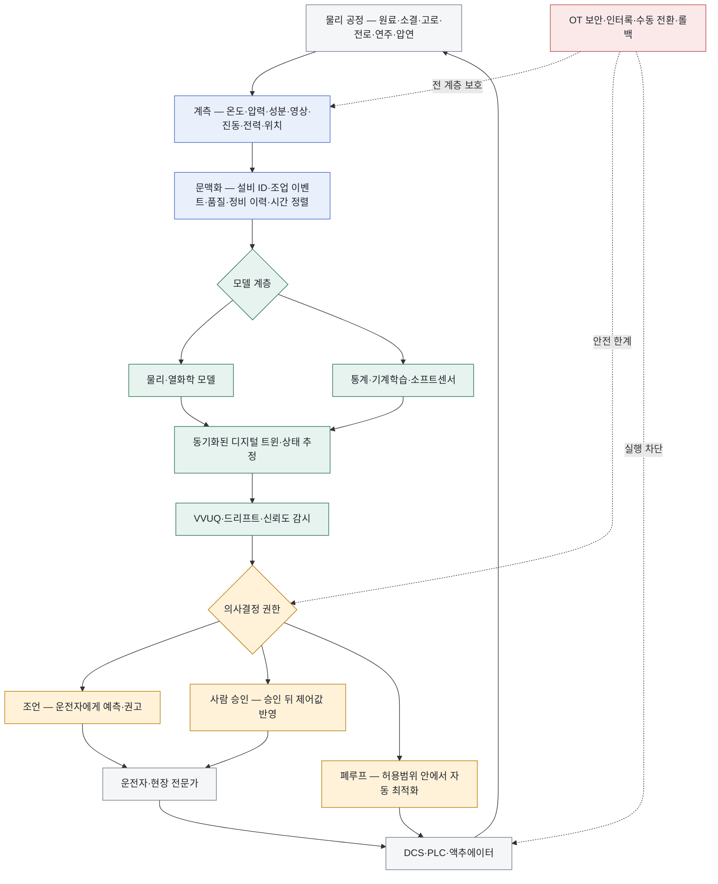

<!-- AUTO-GENERATED BY steel-intelligence. DO NOT EDIT. -->

# 스마트 제철소 (Smart Steelworks)

> 조사 기준일: **2026-07-25** · 공식·1차 자료 중심 · 사실과 AI 분석을 구분해 작성

??? info "관련 기술 바로가기 · 현재 위치: 통합·운영 기술"

    탐색을 위한 편의 분류이며 기술 우열이나 확정된 공정 관계를 뜻하지 않습니다.

    **환원·용융 경로**

    [[technologies/TEC-hydrogen-direct-reduced-iron|수소 직접환원철 (Hydrogen DRI)]] · [[technologies/TEC-hydrogen-based-fine-ore-reduction|무펠릿 미분광 수소환원 (Fluidized-bed Hydrogen Reduction)]] · [[technologies/TEC-electric-smelting-furnace|전기용융로 (Electric Smelting Furnace)]] · [[technologies/TEC-hydrogen-plasma-smelting-reduction|수소 플라즈마 용융환원 (HPSR)]] · [[technologies/TEC-microwave-biomass-ironmaking|마이크로웨이브·바이오매스 환원제철 (BioIron)]]

    **전해 기반 경로**

    [[technologies/TEC-molten-oxide-electrolysis|용융산화물 전기분해 (Molten Oxide Electrolysis)]] · [[technologies/TEC-low-temperature-aqueous-iron-electrolysis|저온 수계 전해제철 (Aqueous Iron Electrolysis)]]

    **기존 설비·순환 경로**

    [[technologies/TEC-blast-furnace-ccus|고로 CCUS]] · [[technologies/TEC-high-grade-eaf-and-scrap-impurity-removal|고급강 EAF·스크랩 불순물 제거]]

    **통합·운영 기술**

    [[technologies/TEC-low-carbon-ironmaking|저탄소 제철 종합 경로 (Low-carbon Ironmaking)]] · **스마트 제철소 (Smart Steelworks) · 현재**

{ .steel-media-image .steel-hero-image .steel-media-detail }

*대표 이미지 — 소결기 내부 연소·열 상태를 센서, 기계학습, 물리 시뮬레이션으로 예측하고 최적 조작으로 되먹임하는 JFE 소결 CPS 구성도 (공정 개념도 · 권리 `link_only` · 출처 [[sources/SRC-20260725-41586A75|SRC-20260725-41586A75]] · [원문 페이지](https://www.jfe-steel.co.jp/en/release/2025/10/251007.html))*

!!! abstract "한눈에 보기"

    | 항목 | 내용 |
    | --- | --- |
    | **분류 (편집)** | 제철 공정의 실시간 계측·모델·의사결정·제어 통합 |
    | **핵심 원리** | 물리 제조공정의 실시간 데이터와 목적 적합한 모델을 지속 동기화해 상태를 추정·예측하고, 검증된 결과를 사람 또는 제어계의 의사결정에 연결하는 운영 체계 [^src-20260725-30a4249e] |
    | **공개 개발 단계** | 고로·전로·소결의 실제 생산현장 적용이 확인되지만 회사·공정별 자동제어 권한과 정량 검증 수준은 서로 다름 [^src-20260725-41586a75] |

## 개요

물리 제조공정의 실시간 데이터와 목적 적합한 모델을 지속 동기화해 상태를 추정·예측하고, 검증된 결과를 사람 또는 제어계의 의사결정에 연결하는 운영 체계 [^src-20260725-30a4249e]

이 문서는 단순 대시보드나 데이터 수집을 스마트 제철소로 간주하지 않습니다. 물리 공정과 모델의 동기화, 예측의 검증, 운전 권한, DCS·PLC로의 되먹임, 사람의 승인과 안전·보안 경계를 분리해 실제 자동화 수준을 판독합니다.

- **근거 확인 기업:** 4개
- **직접 연결 근거:** 10건

## 작동 원리

- **작동 원리:** 센서 입력을 통계·기계학습 모델과 열화학·물리 모델에 결합해 공정 상태를 실시간 예측하고, 예측값에 근거한 최적 조작을 물리 공정에 되먹임 [^src-20260725-41586a75]

## 공정 구성

**색상 범례 (AI 재구성):** 회색=물리 공정·실행 · 청색=계측·데이터 · 녹색=모델·검증 · 황색=사람과 자동화의 권한 · 적색=안전·OT 보안

!!! note "도식 해석"

    위 도식은 NIST의 디지털 트윈·human-in-the-loop·OT 보안 원칙과 철강사 공개 사례를 제철소 운전 계층으로 재구성한 것입니다. 특정 회사의 네트워크 토폴로지나 제어 로직, 실제 인터록 설계도는 아닙니다. [^src-20260725-30a4249e][^src-20260725-41586a75]

## 주요 기술 특성

### 시스템·데이터·모델

| 구분 | 공개된 내용 | 근거 성격 |
| --- | --- | --- |
| **시스템 계층** | 물리 공간, 사이버 공간, 인간 공간을 연결하고 AI 계산과 사람의 인지·승인 역할을 명시하는 3영역 구조 [^src-20260725-8ba7a1b3] | 학회 논문 |
| **센서·계측 계층** | 온도·압력·조성 등 공정 센서뿐 아니라 IoT 카메라·영상계측·운전 이벤트를 물리 상태 입력으로 사용 [^src-20260725-285480de] | 회사 발표 |
| **데이터 문맥화** | 연속 제철 공정의 데이터를 공정·설비·품질 이력과 연결해 추적성, 진단과 운전 데이터 표준화를 지원 [^src-20260725-28e5a30f] | 회사 발표 |
| **모델 계층** | 데이터 기반 통계·기계학습 모델과 열화학 물리 시뮬레이션을 함께 사용하는 하이브리드 모델 [^src-20260725-41586a75] | 회사 발표 |
| **물리–가상 동기화** | 가상 모델은 물리 설비의 현재 상태와 지속 동기화되어야 하며, 단순 3D 화면이나 정적 시뮬레이션만으로 운전용 디지털 트윈이라 할 수 없음 [^src-20260725-30a4249e] | 정부·공공자료 |
| **디지털 스레드** | 설계·생산·품질·정비 데이터를 수명주기 전체에서 연결해 모델 입력과 운전 결정의 계보를 추적 [^src-20260725-30a4249e] | 정부·공공자료 |
| **상호운용성** | 서로 다른 설비·모델·데이터 시스템 간 정의와 인터페이스를 맞추는 참조 아키텍처·개방형 표준이 확산의 전제 [^src-20260725-30a4249e] | 정부·공공자료 |
| **검증·검정·불확도 정량화** | 데이터, 모델과 트윈 결과에 대해 verification·validation·uncertainty quantification을 수행해 목적 적합성과 신뢰도를 입증 [^src-20260725-30a4249e] | 정부·공공자료 |

### 운전 권한·안전·보안

| 구분 | 공개된 내용 | 근거 성격 |
| --- | --- | --- |
| **의사결정·제어 권한** | 예측·권고, 운전자 승인 뒤 실행, 허용범위 내 자율 폐루프는 서로 다른 권한 단계이며 공개 자료에서 명시적으로 구분해야 함 [^src-20260725-8ba7a1b3] | 학회 논문 |
| **사람 개입 구조** | AI의 실시간 계산과 사람의 경험·인지·책임을 함께 의사결정 고리에 두며, 사람의 최종 승인·감독·개입 지점을 설계 [^src-20260725-8ba7a1b3] | 학회 논문 |
| **폐루프 자동제어** | 광양 2전로 사례는 25개 수동 조작을 원터치 순서로 자동화했지만 운영자는 감시·관리 책임을 유지; 완전 무인 자율운전과 동일하지 않음 [^src-20260725-285480de] | 회사 발표 |
| **실시간성·지연** | 소결 CPS는 센서 입력과 하이브리드 모델을 사용해 실시간 예측을 수행; 제어 적용에는 공정 시간상수보다 짧은 지연과 결측 대응이 필요 [^src-20260725-41586a75] | 회사 발표 |
| **안전정지·수동 전환** | AI·트윈 결과가 물리 제어에 연결될 때 인터록, 안전정지, 수동 전환, 변경 롤백과 사고 대응을 포함해야 함 [^src-20260725-017c8bae] | 정부·공공자료 |
| **OT 보안 경계** | DCS·PLC·SCADA 등 OT는 기밀성뿐 아니라 성능·가용성·신뢰성·안전을 동시에 보호해야 하며 네트워크 분리와 최소권한이 필요 [^src-20260725-017c8bae] | 정부·공공자료 |
| **모델 드리프트 관리** | 모델은 원료·설비·운전 조건이 바뀐 뒤에도 목적 적합성을 재검증하고 불확도를 갱신해야 하며, 과거 정확도를 현재 성능으로 자동 이월할 수 없음 [^src-20260725-30a4249e] | 정부·공공자료 |
| **데이터·결정 추적성** | 공정 데이터와 제품·설비 이력을 연결해 이상 진단, 원인 추적과 품질 계보를 지원 [^src-20260725-28e5a30f] | 회사 발표 |

### 반응·셀·공정

| 구분 | 공개된 내용 | 근거 성격 |
| --- | --- | --- |
| **작동 원리** | 센서 입력을 통계·기계학습 모델과 열화학·물리 모델에 결합해 공정 상태를 실시간 예측하고, 예측값에 근거한 최적 조작을 물리 공정에 되먹임 [^src-20260725-41586a75] | 회사 발표 |
| **공정 구성** | 학회 발표 사례는 스크랩 입고 영상·계측을 화학성분 및 MES/ERP와 연결하는 cloud/edge 기반 운영 구성을 제시했다. [^src-20260726-def03677] | 학회 발표 |

### 실증·산업화

| 구분 | 공개된 내용 | 근거 성격 |
| --- | --- | --- |
| **공개 개발 단계** | 고로·전로·소결의 실제 생산현장 적용이 확인되지만 회사·공정별 자동제어 권한과 정량 검증 수준은 서로 다름 [^src-20260725-41586a75] | 회사 발표 |
| **현장 배치 범위** | JFE는 전 고로 공정의 CPS 배치 완료를 발표했고 일본 내 7개 소결 생산설비로 CPS를 전개 중 [^src-20260725-41586a75] | 회사 발표 |
| **성과 측정 지표** | 품질 안정, 수율·생산성, 코크스·에너지 사용, 온실가스, 설비가동률과 안전을 보되 기준기간·원료·설비 상태·수동 개입을 함께 보정해야 함 [^src-20260725-41586a75] | 회사 발표 |
| **공개 정량 성과** | Tata Steel은 소결 디지털 트윈 적용으로 반송 미분을 줄이고 굴뚝 배출을 60% 줄였다고 회사 발표 [^src-20260725-0cc8b82b] | 회사 발표 |
| **공개 성과의 한계** | Tata 소결 사례는 기준기간, 절대 배출량, 적용 라인 수, 결과 지속기간, 통계 불확도와 제어 권한을 공개하지 않음 [^src-20260725-0cc8b82b] | 회사 발표 |
| **다른 설비 확산 조건** | POSCO는 광양 2전로 기술을 포항과 인도네시아로 확대할 로드맵을 발표했으나, 계획은 해당 사업장 배치 완료의 증거가 아님 [^src-20260725-285480de] | 회사 발표 |

## 공개 개발 연혁

| 날짜 | 공개 사건 |
| --- | --- |
| 2020-01-20 | POSCO AI blast furnace and smart steelworks baseline [^src-20260725-28e5a30f] |
| 2022-01-11 | Tata Steel first-in-world digital twin in sinter making [^src-20260725-0cc8b82b] |
| 2023-09-28 | NIST SP 800-82 Rev. 3 Guide to Operational Technology Security [^src-20260725-017c8bae] |
| 2023-10-29 | Conceptual Architecture of Digital Twins with Human-in-the-Loop Based Smart Manufacturing [^src-20260725-8ba7a1b3] |
| 2024-12-11 | POSCO One-Touch Converter Operation Automation Technology [^src-20260725-285480de] |
| 2025-10-07 | JFE Steel deploys CPS technology across sintering facilities [^src-20260725-41586a75] |
| 2026-03-09 | Evolving Scrapyard: Integrating New Solutions for Advanced Scrap Management [^src-20260726-def03677] |
| 2026-07-20 | Digital Twins for Advanced Manufacturing [^src-20260725-30a4249e] |

## 설비·공정 이미지

{ .steel-media-image .steel-media-detail }

**학술 자료 그림.** NIST가 개발한 밀링머신·좌표측정기·로봇팔의 실제 설비와 디지털 트윈 대응 예시

- 출처 [[sources/SRC-20260725-30A4249E|SRC-20260725-30A4249E]] · 권리 `link_only` · [원문 페이지](https://www.nist.gov/programs-projects/digital-twins-advanced-manufacturing) · 작성·촬영 National Institute of Standards and Technology
- 권리 메모: NIST 공식 프로그램 페이지의 원본을 확인했습니다. 철강 전용 도면이 아닌 제조 디지털 트윈의 일반 예시이며 원격 링크로 표시합니다.

{ .steel-media-image .steel-media-detail }

**공정 개념도.** 제철소 센서·운전데이터에서 사이버 모델·AI로 올라가 운전지침과 로봇 자동화로 되돌아오는 JFE 지능형 제철소 CPS 전체 구조

- 출처 [[sources/SRC-20260725-41586A75|SRC-20260725-41586A75]] · 권리 `link_only` · [원문 페이지](https://www.jfe-steel.co.jp/en/release/2025/10/251007.html) · 작성·촬영 JFE Steel Corporation
- 권리 메모: JFE Steel 공식 발표의 Figure 2 원본을 확인했습니다. 재사용 권한을 별도 확인하지 않아 원격 링크로만 표시합니다.

## 기업별 상세 현황

### [[companies/COM-POSCO|POSCO]]

**확인된 현황.** 포항 2고로 AI 예측·제어와 제철소 연속공정용 PosFrame 운용이 확인됨; 2020년 기준선이며 현재 전 설비 배치 범위는 미확인 [^src-20260725-28e5a30f]

**단계 판단: 공식 현황 확인.** 공식 자료에서 관련 움직임은 확인되지만 단계 구분에 필요한 일정·설비·운전 정보가 충분하지 않습니다.

- **날짜:** 발표 2020-01-20 · 수집 2026-07-25 · 검증 2026-07-25

### [[companies/COM-Nippon-Steel|Nippon Steel]]

**확인된 현황.** 원격운전·자동화·AI·고급 알고리즘의 연구 및 실용화 연구 단계; 전사 배치 여부는 이 출처로 미확인 [^src-20260725-45a1d063]

**단계 판단: 연구·실증.** 기술 가능성을 검증하는 단계입니다. 시험 규모의 성공을 상용 생산성과로 해석하지 않고 규모 확대 계획을 따로 확인해야 합니다.

- **날짜:** 발표 미상 · 수집 2026-07-25 · 검증 2026-07-25

### [[companies/COM-JFE-Steel|JFE Steel]]

**확인된 현황.** 전 고로 CPS 배치 완료, 일본 7개 소결설비에 CPS 전개 중; 센서·AI·물리모델 기반 실시간 예측 [^src-20260725-41586a75]

**단계 판단: 가동·현장 적용.** 연구 발표를 넘어 설비 가동 또는 생산현장 적용이 확인됩니다. 다만 이용률과 제품 단위 성과는 별도 운전 데이터로 검증해야 합니다.

- **날짜:** 발표 2025-10-07 · 수집 2026-07-25 · 검증 2026-07-25

### [[companies/COM-Tata-Steel|Tata Steel]]

**확인된 현황.** 소결 Digital Twin과 Jamshedpur·Kalinganagar·IJmuiden WEF Global Lighthouse 확인 [^src-20260725-6c80084b]

**단계 판단: 공식 현황 확인.** 공식 자료에서 관련 움직임은 확인되지만 단계 구분에 필요한 일정·설비·운전 정보가 충분하지 않습니다.

- **날짜:** 발표 미상 · 수집 2026-07-25 · 검증 2026-07-25

## 관련 프로젝트

기술의 실제 확대 단계를 확인할 수 있도록 프로젝트 문서와 현재 상태를 직접 연결합니다. 각 프로젝트 문서에는 최근 상태뿐 아니라 확인 가능한 전체 일정 이력이 표시됩니다.

| 프로젝트 | 현재 확인 상태 | 일정·규모 |
| --- | --- | --- |
| **[[projects/PRJ-POSCO-GWANGYANG-ONE-TOUCH-CONVERTER|POSCO 광양 2전로 원터치 자동화]]** | 광양제철소 제2전로에서 원터치 자동운전과 원격 기동·조업 시연이 확인된 생산현장 적용 사례 [^src-20260725-285480de] | - |
| **[[projects/PRJ-JFE-SINTER-CPS-ROLLOUT|JFE 일본 7개 소결설비 CPS 전개]]** | 일본 내 7개 소결 생산설비에 CPS 전개 중이며 전 고로 공정의 CPS 배치는 완료됐다고 회사 발표 [^src-20260725-41586a75] | - |

## 기술적 쟁점과 미공개 데이터

!!! warning "AI 분석 — 공개 근거와 구분"

    기업별 단계는 인용된 공식 발표 문구를 기준으로 분류한 것으로, 정식 TRL 판정이나 기술 경쟁력 순위가 아닙니다.

- **추가 확인이 필요한 데이터:** 적용 공정·설비 수·운전기간, 모델 입력과 검증 기준, 조언·사람 승인·폐루프 중 실제 권한, 수동 전환·인터록·OT 보안, 기준선이 공개된 정량 성과와 다른 공장으로의 재현 여부를 확인해야 합니다.
- 기업 간 비교에는 시험 규모, 실제 투입 원료·에너지 조건, 상용 운전 실적과 제품 단위 배출량을 같은 기준으로 적용해야 합니다.
- ‘예측’, ‘권고’, ‘원터치’, ‘자동운전’은 같은 단계가 아닙니다. 모델이 값을 보여주는 단계, 운전자가 승인하는 단계, 제어기가 허용범위 안에서 스스로 조정하는 폐루프 단계를 구분해야 사고 책임과 성과를 비교할 수 있습니다.
- 디지털 트윈은 3D 화면의 유무보다 물리 설비와의 동기화, 모델의 목적 적합성, 검증·검정·불확도 정량화(VVUQ), 수명주기 데이터 연결이 핵심입니다. 화면이 정교해도 실제 센서 상태와 시간 정렬이 끊기면 운전용 트윈이 아닙니다.
- 제철 공정은 측정이 늦거나 직접 측정할 수 없는 품질 변수가 많아 소프트센서가 중요합니다. 다만 원료 배합·노체 상태·계절·설비 보수 뒤 데이터 분포가 바뀌므로 드리프트 감지와 재검증 없이 과거 정확도를 현재 성능으로 간주하면 안 됩니다.
- 물리 모델과 기계학습을 결합한 하이브리드 모델은 데이터가 드문 비정상 영역에서 물리 제약을 제공하고, 학습 모델은 계산속도와 잔차 보정을 담당할 수 있습니다. 모델별 실패모드와 전환 조건까지 공개돼야 실시간 운전 신뢰도를 평가할 수 있습니다.
- 단일 라인의 성과를 전 제철소 성과로 확대 해석하면 안 됩니다. 적용 설비 수, 운전시간, 제품·원료 범위, 자동제어 사용률, 수동 복귀 횟수와 다른 사업장 재현성을 함께 확인해야 ‘확산’이 입증됩니다.
- 생산량·수율·에너지 개선은 기준기간, 비교군, 원료·설비 보정, 통계적 불확도와 지속기간이 없으면 인과 효과를 분리하기 어렵습니다. 회사 발표 수치는 유용한 신호지만 독립 검증 성과와 구분해야 합니다.
- AI가 DCS·PLC 명령에 연결되는 순간 분석 시스템이 안전중요 OT의 일부가 됩니다. 네트워크 분리, 최소권한, 모델·설정 변경관리, 명령 허용범위, 인터록, 수동 전환, 롤백과 사고 로그가 모델 정확도만큼 중요합니다.
- 스마트화의 경제성은 모델 개발비만이 아니라 센서 신뢰도, 데이터 정비, 엣지 컴퓨팅, 제어계 통합, 사이버보안, 교대조 교육과 모델 수명주기 운영비를 포함해 라인별 손실 회피·품질·에너지 편익과 비교해야 합니다.

## POSCO 관점 시사점

!!! info "AI 분석 — 전략 검토용"

    다음 내용은 공개 근거를 바탕으로 한 비교 분석이며, POSCO의 공식 결정이나 투자 권고가 아닙니다.

- POSCO는 포항 2고로 AI와 광양 2전로 원터치 자동화라는 서로 다른 제어 사례를 보유합니다. 두 사례를 하나의 ‘AI 적용’으로 합치지 말고 공정별 센서, 예측 대상, 운전자 권한, 자동 실행 범위와 성과 기준을 공통 양식으로 관리해야 합니다.
- 광양 2전로의 25개 수동 조작 통합과 97% 예측 정확도는 구체적이지만, 정확도의 정의·오차분포·제품별 편차·수동 개입·인터록 작동 이력까지 있어야 장기 폐루프 성능을 판정할 수 있습니다. 포항·인도네시아 확대 계획은 실제 배치와 분리합니다.
- JFE의 전 고로 CPS와 7개 소결설비 전개는 수평 확산의 비교 기준입니다. POSCO도 단일 대표 사례보다 설비별 배치율, 재사용 가능한 모델·데이터 표준, 현장별 재학습 비용과 정량 성과 공개 수준을 비교하는 편이 유용합니다.
- 우선 모니터링 지표는 센서 결측률·지연, 모델 오차와 신뢰구간, 드리프트 경보, 권고 채택률, 자동제어 사용률, 수동 복귀·인터록 횟수, 품질·수율·에너지의 보정 후 효과, 가동률, 장애복구시간과 OT 보안 사고입니다.

## 출처

- [[sources/SRC-20260725-017C8BAE|NIST SP 800-82 Rev. 3 Guide to Operational Technology Security]] — National Institute of Standards and Technology, 2023-09-28 · [원문](https://csrc.nist.gov/pubs/sp/800/82/r3/final)
- [[sources/SRC-20260725-0CC8B82B|Tata Steel first-in-world digital twin in sinter making]] — Tata Steel, 2022-01-11 · [원문](https://www.tatasteel.com/newsroom/press-releases/india/2022/tata-steel-declared-as-one-of-the-joint-winners-as-top-innovative-company-large-in-manufacturing-category-at-cii-industrial-innovation-awards-2021/)
- [[sources/SRC-20260725-285480DE|POSCO One-Touch Converter Operation Automation Technology]] — POSCO Group Newsroom, 2024-12-11 · [원문](https://newsroom.posco.com/en/tech-talk-part-8-poscos-game-changing-one-touch-converter-operation-automation-technology/)
- [[sources/SRC-20260725-28E5A30F|POSCO AI blast furnace and smart steelworks baseline]] — POSCO Group Newsroom, 2020-01-20 · [원문](https://newsroom.posco.com/en/meet-the-ai-blast-furnace-of-pohang-works/)
- [[sources/SRC-20260725-30A4249E|Digital Twins for Advanced Manufacturing]] — National Institute of Standards and Technology, 2026-07-20 · [원문](https://www.nist.gov/programs-projects/digital-twins-advanced-manufacturing)
- [[sources/SRC-20260725-41586A75|JFE Steel deploys CPS technology across sintering facilities]] — JFE Steel Corporation, 2025-10-07 · [원문](https://www.jfe-steel.co.jp/en/release/2025/10/251007.html)
- [[sources/SRC-20260725-45A1D063|Nippon Steel research and development for carbon-neutral steelmaking]] — Nippon Steel Corporation, 게시일 미상 · [원문](https://www.nipponsteel.com/en/sustainability/quality/rd.html)
- [[sources/SRC-20260725-6C80084B|Tata Steel climate action technology roadmap]] — Tata Steel, 게시일 미상 · [원문](https://www.tatasteel.com/sustainability/environment/climate-action/)
- [[sources/SRC-20260725-8BA7A1B3|Conceptual Architecture of Digital Twins with Human-in-the-Loop Based Smart Manufacturing]] — National Institute of Standards and Technology, 2023-10-29 · [원문](https://www.nist.gov/publications/conceptual-architecture-digital-twins-human-loop-based-smart-manufacturing)
- [[sources/SRC-20260726-DEF03677|Evolving Scrapyard: Integrating New Solutions for Advanced Scrap Management]] — Association for Iron & Steel Technology, 2026-03-09 · [원문](https://www.aist.org/getmedia/e771fab2-8303-4f35-b945-bcac8028c804/Evolving-Scrapyard-Intergrating-New-Solutions-Advanced.pdf)

[^src-20260725-017c8bae]: **NIST SP 800-82 Rev. 3 Guide to Operational Technology Security** — National Institute of Standards and Technology, 2023-09-28. [원문](https://csrc.nist.gov/pubs/sp/800/82/r3/final) · [[sources/SRC-20260725-017C8BAE|보관 원문·메타데이터]]
[^src-20260725-0cc8b82b]: **Tata Steel first-in-world digital twin in sinter making** — Tata Steel, 2022-01-11. [원문](https://www.tatasteel.com/newsroom/press-releases/india/2022/tata-steel-declared-as-one-of-the-joint-winners-as-top-innovative-company-large-in-manufacturing-category-at-cii-industrial-innovation-awards-2021/) · [[sources/SRC-20260725-0CC8B82B|보관 원문·메타데이터]]
[^src-20260725-285480de]: **POSCO One-Touch Converter Operation Automation Technology** — POSCO Group Newsroom, 2024-12-11. [원문](https://newsroom.posco.com/en/tech-talk-part-8-poscos-game-changing-one-touch-converter-operation-automation-technology/) · [[sources/SRC-20260725-285480DE|보관 원문·메타데이터]]
[^src-20260725-28e5a30f]: **POSCO AI blast furnace and smart steelworks baseline** — POSCO Group Newsroom, 2020-01-20. [원문](https://newsroom.posco.com/en/meet-the-ai-blast-furnace-of-pohang-works/) · [[sources/SRC-20260725-28E5A30F|보관 원문·메타데이터]]
[^src-20260725-30a4249e]: **Digital Twins for Advanced Manufacturing** — National Institute of Standards and Technology, 2026-07-20. [원문](https://www.nist.gov/programs-projects/digital-twins-advanced-manufacturing) · [[sources/SRC-20260725-30A4249E|보관 원문·메타데이터]]
[^src-20260725-41586a75]: **JFE Steel deploys CPS technology across sintering facilities** — JFE Steel Corporation, 2025-10-07. [원문](https://www.jfe-steel.co.jp/en/release/2025/10/251007.html) · [[sources/SRC-20260725-41586A75|보관 원문·메타데이터]]
[^src-20260725-45a1d063]: **Nippon Steel research and development for carbon-neutral steelmaking** — Nippon Steel Corporation, 게시일 미상. [원문](https://www.nipponsteel.com/en/sustainability/quality/rd.html) · [[sources/SRC-20260725-45A1D063|보관 원문·메타데이터]]
[^src-20260725-6c80084b]: **Tata Steel climate action technology roadmap** — Tata Steel, 게시일 미상. [원문](https://www.tatasteel.com/sustainability/environment/climate-action/) · [[sources/SRC-20260725-6C80084B|보관 원문·메타데이터]]
[^src-20260725-8ba7a1b3]: **Conceptual Architecture of Digital Twins with Human-in-the-Loop Based Smart Manufacturing** — National Institute of Standards and Technology, 2023-10-29. DOI: [10.1115/imece2023-112791](https://doi.org/10.1115/imece2023-112791). [원문](https://www.nist.gov/publications/conceptual-architecture-digital-twins-human-loop-based-smart-manufacturing) · [[sources/SRC-20260725-8BA7A1B3|보관 원문·메타데이터]]
[^src-20260726-def03677]: **Evolving Scrapyard: Integrating New Solutions for Advanced Scrap Management** — Association for Iron & Steel Technology, 2026-03-09. [원문](https://www.aist.org/getmedia/e771fab2-8303-4f35-b945-bcac8028c804/Evolving-Scrapyard-Intergrating-New-Solutions-Advanced.pdf) · [[sources/SRC-20260726-DEF03677|보관 원문·메타데이터]]
