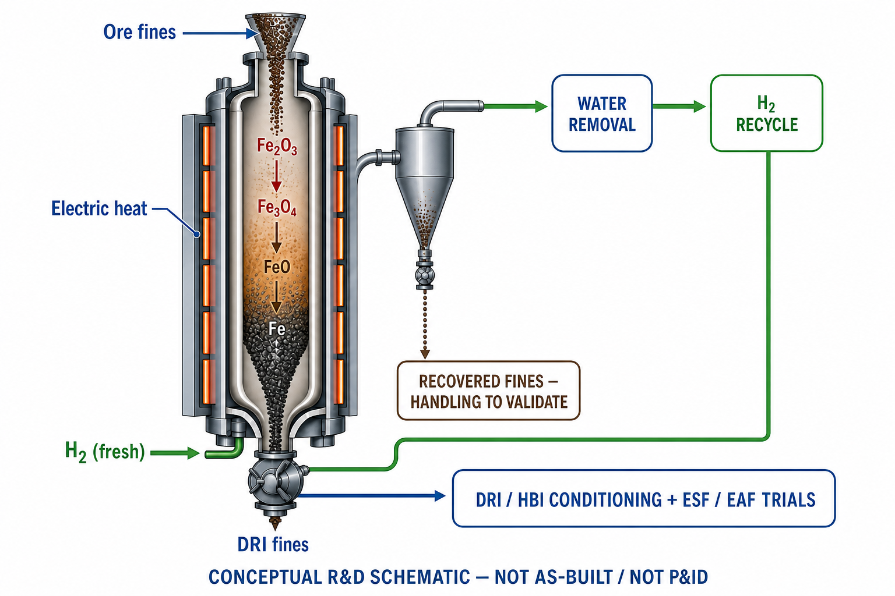
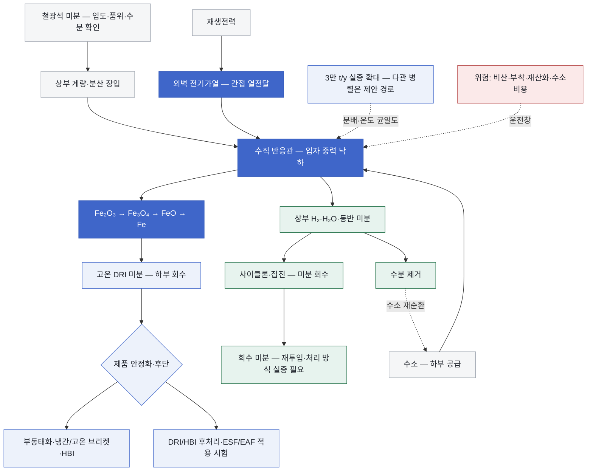

<!-- AUTO-GENERATED BY steel-intelligence. DO NOT EDIT. -->

# ZESTY 수소 직접 플래시 환원

> 조사 기준일: **2026-07-27** · 공식·1차 자료 중심 · 사실과 AI 분석을 구분해 작성

??? info "관련 기술 바로가기 · 현재 위치: 환원·용융 경로"

    탐색을 위한 편의 분류이며 기술 우열이나 확정된 공정 관계를 뜻하지 않습니다.

    **환원·용융 경로**

    [[technologies/TEC-hydrogen-direct-reduced-iron|수소 직접환원철 (Hydrogen DRI)]] · [[technologies/TEC-hydrogen-based-fine-ore-reduction|무펠릿 미분광 수소환원 (Fluidized-bed Hydrogen Reduction)]] · **ZESTY 수소 직접 플래시 환원 · 현재** · [[technologies/TEC-electric-smelting-furnace|전기용융로 (Electric Smelting Furnace)]] · [[technologies/TEC-hisarna-cyclone-smelting-reduction|HIsarna 사이클론 용융환원]] · [[technologies/TEC-hydrogen-plasma-smelting-reduction|수소 플라즈마 용융환원 (HPSR)]] · [[technologies/TEC-microwave-biomass-ironmaking|마이크로웨이브·바이오매스 환원제철 (BioIron)]]

    **전해 기반 경로**

    [[technologies/TEC-molten-oxide-electrolysis|용융산화물 전기분해 (Molten Oxide Electrolysis)]] · [[technologies/TEC-low-temperature-aqueous-iron-electrolysis|저온 수계 전해제철 (Aqueous Iron Electrolysis)]]

    **기존 설비·순환 경로**

    [[technologies/TEC-blast-furnace-ccus|고로 CCUS]] · [[technologies/TEC-high-grade-eaf-and-scrap-impurity-removal|고급강 EAF·스크랩 불순물 제거]]

    **통합·운영 기술**

    [[technologies/TEC-low-carbon-ironmaking|저탄소 제철 종합 경로 (Low-carbon Ironmaking)]] · [[technologies/TEC-smart-steelworks|스마트 제철소 (Smart Steelworks)]]

{ .steel-media-image .steel-hero-image .steel-media-detail }

*대표 이미지 — AI 재구성 — 전기가열 관형 반응기에서 철광석 미분을 수소로 단계 환원하고, 수분 제거 후 수소를 재순환하며 DRI 미분을 후단 조정·ESF/EAF 시험으로 보내는 ZESTY 연구 개념도. 회수 미분 처리와 후단 통합은 검증 과제로 표시했으며, 실제 30 kt/y 설비의 준공도나 P&ID가 아니다. (AI 재구성 · 권리 `ai_generated` · 출처 [[sources/SRC-20260727-C43117BC|SRC-20260727-C43117BC]] · [원문 페이지](https://arena.gov.au/projects/calix-zesty-green-iron-demonstration-plant))*

!!! abstract "한눈에 보기"

    | 항목 | 내용 |
    | --- | --- |
    | **분류 (편집)** | 간접 전기가열 낙하입자식 미분광 수소 직접환원 |
    | **핵심 원리** | 간접 가열 수직 관형 반응기에서 미분 철광석을 중력 하강시키고, 하부에서 공급한 수소와 향류 접촉해 고체 DRI를 만드는 flash hydrogen reduction 공정 [^src-20260727-824dd247] |
    | **적용 원료** | 일반적으로 500 µm 미만 철광석 미분을 직접 투입하며 펠릿화 생략 가능성을 지향 [^src-20260727-824dd247] |

## 개요

간접 가열 수직 관형 반응기에서 미분 철광석을 중력 하강시키고, 하부에서 공급한 수소와 향류 접촉해 고체 DRI를 만드는 flash hydrogen reduction 공정 [^src-20260727-824dd247]

이 문서는 Calix의 Zero Emissions Steel Technology(ZESTY)를 중심으로 다룹니다. 유동화 가스로 입자를 부유시키는 HyREX·HYFOR 계열과 달리 중력 낙하입자·역류 수소·간접 벽면가열이 핵심이며, 고온 직접가열형 Utah Flash Ironmaking Technology와도 운전온도·열전달·산업 프로그램을 구분합니다.

- **근거 확인 기업:** 0개
- **직접 연결 근거:** 2건

## 작동 원리

- **작동 원리:** 반응기 벽을 전기로 간접 가열해 환원열을 공급하고 수소는 주로 환원제로 사용하며, 배가스 수분 제거 뒤 미반응 수소 재순환을 제안 [^src-20260727-824dd247]

## 공정 구성

**색상 범례 (AI 재구성):** 회색=원료·에너지 · 진한 코발트=간접가열 플래시 환원 · 녹색=가스·미분 회수 · 옅은 코발트=제품·확대 · 적색=운전 위험

!!! note "도식 해석"

    위 흐름도는 ARENA 사업자료와 동료심사 논문의 공개 공정을 기능 단위로 재구성한 것입니다. Rockingham 실증설비의 준공도·배관계장도(P&ID)나 확정된 다관 배치가 아닙니다. [^src-20260727-824dd247]

## 주요 기술 특성

### 반응·셀·공정

| 구분 | 공개된 내용 | 근거 성격 |
| --- | --- | --- |
| **작동 원리** | 반응기 벽을 전기로 간접 가열해 환원열을 공급하고 수소는 주로 환원제로 사용하며, 배가스 수분 제거 뒤 미반응 수소 재순환을 제안 [^src-20260727-824dd247] | 학술지 논문 |

### 원료·운전·제품

| 구분 | 공개된 내용 | 근거 성격 |
| --- | --- | --- |
| **적용 원료** | 일반적으로 500 µm 미만 철광석 미분을 직접 투입하며 펠릿화 생략 가능성을 지향 [^src-20260727-824dd247] | 학술지 논문 |

### 최신 실증·검증 정보

기존 분류표에 속하지 않는 최신 공개 결과와 확대 계획을 별도로 보존합니다. 목표·계획 문구는 달성 실적으로 해석하지 않습니다.

| 구분 | 공개된 내용 | 근거 성격 |
| --- | --- | --- |
| **이론적 최소 수소량** | hematite 기준 54 kg H2/t-iron 이론 최소치에 접근을 목표; 실측 원단위가 아님 [^src-20260727-c43117bc] | 정부·공공자료 |
| **제안 scale-up 방식** | 단일 파일럿 관에서 full-scale 관과 병렬 다관 모듈로 확대하고 전후단 예열·열회수를 통합하는 경로를 제안 [^src-20260727-824dd247] | 학술지 논문 |
| **파일럿 광석 투입률** | 60 kg/h semi-continuous ore feed [^src-20260727-824dd247] | 학술지 논문 |
| **파일럿 금속화 결과** | 조사한 조건에서 최대 95% metallisation; 연속 실증플랜트 성능이 아닌 파일럿 조건부 최고값 [^src-20260727-824dd247] | 학술지 논문 |
| **파일럿 반응기 구성** | 내경 0.2 m, 길이 18 m 수직관과 길이 방향 18개 독립 전기히터 [^src-20260727-824dd247] | 학술지 논문 |
| **파일럿 벽온 범위** | 850–1050 °C 균일 벽온 조건 [^src-20260727-824dd247] | 학술지 논문 |
| **핵심 scale-up 위험** | 입도·체류시간·수소 화학양론·열 및 물질전달, 고온 sticking, 미분 회수와 수소 recycle, DRI/HBI 후처리의 연속운전 검증 [^src-20260727-824dd247] | 학술지 논문 |

## 공개 개발 연혁

| 날짜 | 공개 사건 |
| --- | --- |
| 2025-02-10 | New Insights Into Hydrogen Reduction of Hematite in an Indirectly Heated Flash Reactor from Measurements and First-Order Modeling [^src-20260727-824dd247] |
| 2026-03-30 | Calix - ZESTY Green Iron Demonstration Plant [^src-20260727-c43117bc] |

## 설비·공정 이미지

{ .steel-media-image .steel-media-detail }

**학술 자료 그림.** ZESTY 단일 관형 파일럿 반응기와 30 kt/y 제안 공정 흐름. 논문 Figure 1이며 30 kt/y 설비의 준공도가 아니다.

- 출처 [[sources/SRC-20260727-824DD247|SRC-20260727-824DD247]] · 권리 `link_only` · [원문 페이지](https://link.springer.com/article/10.1007/s11663-025-03465-3/figures/1) · 작성·촬영 Mokhtarani et al.; figure provided by Calix team
- 권리 메모: Springer Nature 원문 서버 직접 표시. 로컬 복제하지 않았으며 재사용 조건은 원문 라이선스를 따른다.

## 기업별 상세 현황

## 관련 프로젝트

기술의 실제 확대 단계를 확인할 수 있도록 프로젝트 문서와 현재 상태를 직접 연결합니다. 각 프로젝트 문서에는 최근 상태뿐 아니라 확인 가능한 전체 일정 이력이 표시됩니다.

| 프로젝트 | 현재 확인 상태 | 일정·규모 |
| --- | --- | --- |
| **[[projects/PRJ-ZESTY-ROCKINGHAM-DEMO|Calix ZESTY Rockingham 3만 t/y 실증 계획]]** | 파일럿 시험 이후 30,000 t/y 플랜트의 건설·시운전·운전과 상용 Pre-FEED/FEED를 수행하는 프로젝트; 2026-03-30 공개자료에는 준공·가동 실적 없음 [^src-20260727-c43117bc] | **연간 생산능력** 30,000 t/y HDRI 설계목표 [^src-20260727-c43117bc] |

## 기술적 쟁점과 미공개 데이터

!!! warning "AI 분석 — 공개 근거와 구분"

    기업별 단계는 인용된 공식 발표 문구를 기준으로 분류한 것으로, 정식 TRL 판정이나 기술 경쟁력 순위가 아닙니다.

- **추가 확인이 필요한 데이터:** 향후 12~36개월 동안 Rockingham의 인허가·FID·EPC와 수소계약, 단일관·다관 연속운전 시간, 광종별 금속화율·Fe 수율·분진회수, 실측 수소·전력원단위, HBI/ESF 제품검증, CAPEX/OPEX 갱신과 Rio Tinto의 배치·라이선스 결정을 확인해야 합니다.
- 기업 간 비교에는 시험 규모, 실제 투입 원료·에너지 조건, 상용 운전 실적과 제품 단위 배출량을 같은 기준으로 적용해야 합니다.
- 간접가열은 수소를 연료가 아니라 환원제로 집중해 쓰고 전력으로 반응열을 공급할 수 있게 합니다. 다만 이론적 최소 수소량과 실제 플랜트 원단위는 수분 제거·purge·미반응 수소 재순환을 포함해 구분해야 합니다. 공개 논문에 정제·압축 사양과 회수 미분 재투입 방식은 확정돼 있지 않습니다.
- ‘펠릿 불필요’는 ‘선광·건조·분급·집진 불필요’를 뜻하지 않습니다. 저품위광의 맥석이 남으면 DRI 제품량, ESF 슬래그량·전력·플럭스와 철 회수율에 부담이 이동합니다.
- ARENA의 3만 t/y 실증 목표와 논문의 병렬 다관 scale-up 제안은 서로 다른 근거입니다. 파일럿 단일관의 온도·금속화 성능을 선형 확대할 수 없으며, 관별 광석·수소 분배, 벽면 열플럭스, 고체농도와 정비격리가 독립 변수입니다.
- 상부로 동반되는 초미분은 집진 부하일 뿐 아니라 철 수율 손실입니다. 평균 금속화율과 함께 입도별 제품·분진 질량수지, 재순환 횟수, 사이클론 마모와 filter differential pressure가 공개돼야 합니다.
- 고온 DRI 미분은 재산화·발화·분진폭발 위험이 있어 부동태화, HBI 또는 밀폐 고온이송이 필요합니다. 환원 반응기 성능과 제품 물류·후단 ESF/EAF 품질을 별도 검증해야 합니다.
- ARENA 실증사업의 개시·FEED는 기술의 산업 실행 신호지만 상용 경쟁력 입증은 아닙니다. Rockingham의 재생수소 가격, 장기 연속운전과 복수 Pilbara 광종의 toll processing 결과가 다음 판단 기준입니다.

## POSCO 관점 시사점

!!! info "AI 분석 — 전략 검토용"

    다음 내용은 공개 근거를 바탕으로 한 비교 분석이며, POSCO의 공식 결정이나 투자 권고가 아닙니다.

- HyREX와 동일한 Pilbara 정광을 사용해 원료 전처리, 수소 kg/t-Fe, 전력 kWh/t-Fe, 금속화율 분포, Fe 수율, 분진 재순환과 ESF 슬래그를 같은 경계에서 비교해야 합니다.
- ZESTY를 HyREX 전체 대체기술로만 보지 말고, ESF 전단의 부분환원 모듈이나 광종별 전처리-환원 옵션으로 평가할 필요가 있습니다. 최적 부분환원도는 반응기와 ESF의 합산 전력·철 수율로 결정해야 합니다.
- Calix–Rio Tinto의 비독점 공동개발 구조, 반응관·calciner 특허와 라이선스 조건을 확인해 POSCO 독자시험·협력·회피설계의 FTO를 조기에 검토해야 합니다.
- 향후 12~36개월 선행지표는 Rockingham 인허가·FID/EPC, 수소 공급계약, 정격 단일관과 다관 모듈의 연속시간, 광종별 금속화–Fe수율–분진–에너지 동시 데이터, HBI/ESF 고객시험과 CAPEX/OPEX 갱신입니다.
- 판단 질문은 ‘실측 원단위가 이론값에 얼마나 접근하는가’, ‘관별 분배편차를 어떻게 계측·제어하는가’, ‘고온 DRI 미분을 어떤 형태로 ESF에 연결하는가’, ‘수소가격 상승 후에도 펠릿 생략 편익이 남는가’입니다.

## 12–36개월 기술 센싱 대시보드

!!! info "AI 분석 — 연구·전략 의사결정용"

    아래 항목은 공개된 목표가 실제 성과로 전환되는지를 추적하기 위한 관찰 프레임입니다. 정식 TRL 판정이나 투자 권고가 아닙니다.

### 성숙도 승격 신호

- Rockingham의 환경허가·FID·EPC·수소계약이 30,000 t/y 실증 착공·시운전으로 전환
- 단일관과 병렬 다관 모듈에서 연속시간, 관별 분배편차, 금속화–Fe수율–분진–수소·전력 원단위를 광종별로 동시 공개
- DRI/HBI 안정화와 복수 철강사의 BF-BOF·ESF/EAF 제품시험, CAPEX/OPEX 갱신이 확인

### 지연·실패 신호

- 54 kg H2/t 이론값 또는 파일럿 최대 95% 금속화를 실증플랜트 평균 실적으로 표현
- 회수 미분 재투입, 수소 정제·압축, 다관 배치와 고온이송이 확정되지 않았는데 완성 공정도처럼 제시

### POSCO 판단 질문

- HyREX와 같은 Pilbara 광석 경계에서 펠릿 생략 편익이 수소·전력·분진·ESF 슬래그 부담을 상쇄하는가?
- 관별 분배와 정비격리를 어떻게 계측·제어하고 단일관 성능을 plant availability로 변환할 것인가?
- 협력·라이선스·독자시험 중 어떤 방식으로 반응관·calciner IP와 FTO를 확보할 것인가?

## 출처

- [[sources/SRC-20260727-824DD247|New Insights Into Hydrogen Reduction of Hematite in an Indirectly Heated Flash Reactor from Measurements and First-Order Modeling]] — Springer Nature, 2025-02-10 · [원문](https://link.springer.com/article/10.1007/s11663-025-03465-3)
- [[sources/SRC-20260727-C43117BC|Calix - ZESTY Green Iron Demonstration Plant]] — Australian Renewable Energy Agency, 2026-03-30 · [원문](https://arena.gov.au/projects/calix-zesty-green-iron-demonstration-plant/)

[^src-20260727-824dd247]: **New Insights Into Hydrogen Reduction of Hematite in an Indirectly Heated Flash Reactor from Measurements and First-Order Modeling** — Springer Nature, 2025-02-10. DOI: [10.1007/s11663-025-03465-3](https://doi.org/10.1007/s11663-025-03465-3). [원문](https://link.springer.com/article/10.1007/s11663-025-03465-3) · [[sources/SRC-20260727-824DD247|보관 원문·메타데이터]]
[^src-20260727-c43117bc]: **Calix - ZESTY Green Iron Demonstration Plant** — Australian Renewable Energy Agency, 2026-03-30. [원문](https://arena.gov.au/projects/calix-zesty-green-iron-demonstration-plant/) · [[sources/SRC-20260727-C43117BC|보관 원문·메타데이터]]
